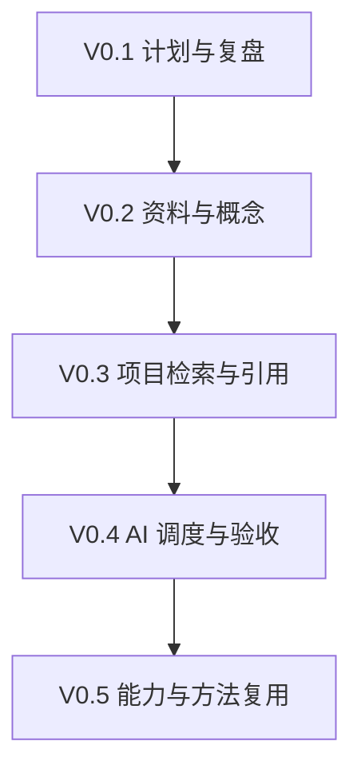
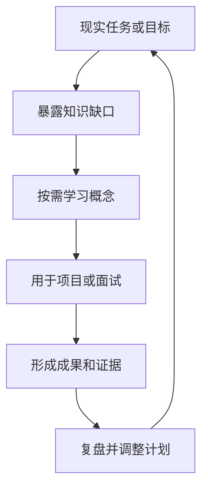

# AI Learning OS 渐进式产品 PRD v0.2

> 文档状态：开发基线  
> 更新日期：2026-08-04  
> 当前建设版本：产品 V0.1「计划工作台」  
> 目标成本：V0.1—V0.3 现金成本 $0/月  
> 核心约束：求职转型优先；系统边用边长；每周系统建设最多占 1—2 小时

---

## 0. 一段话说明白

AI Learning OS 的目标，是做一个能逐步替代现有学习表格、帮助用户围绕现实目标动态安排学习与项目的个人工作台；首版只把目标、项目、任务、资料、成果、证据和周复盘组织清楚，让用户每周知道“现在主攻什么、为什么、做到什么算完成”，后续再逐步加入资料统筹、项目上下文、RAG、AI 调度、证据评测和长期记忆，最终形成“输入资料或现实问题—按需学习—完成项目—形成可评审成果—复盘更新计划”的闭环。它服务于当前求职转型，但不取代 AI 学习、Business 探索或真实作品项目，也不把 Gemini 测评误设为系统主线。

---

# 第一部分：产品定位与边界

## 1. 现阶段的目标层级

必须区分“人生与职业目标”“成长路线”“作品项目”和“学习工具”，避免系统建设反客为主。

| 层级 | 当前定义 |
|---|---|
| 当前总目标 | 从零基础完成求职转型与面试准备；现阶段约 80% 的投入应直接或间接服务于此 |
| 长期能力轴 | AI 能力与 Business 能力并行，不把个人身份锁死为纯 AI 角色 |
| 当前求职方向 | 企业服务 AI 产品经理 / AI 解决方案产品经理；同时保留企业服务、行业数字化、数据智能等相邻岗位 |
| 作品项目 | Notebook 测评与关键机制复现、企业级知识库、待验证的业务工作流 Agent |
| 学习工具 | AI Learning OS，用于管理和调度上述学习与实践，不自动占据三项主作品名额 |
| 内容输出 | 从学习与项目中提炼，归入 Business 验证，不单独制造大量任务 |

这里的“80% 为求职服务”不等于 80% 只学 RAG、Agent 或写代码。JD 分析、基础补课、产品能力、项目成果、简历、面试和投递反馈都属于求职投入。

## 2. 产品定位

> AI Learning OS 是一个单用户优先、渐进增强的个人学习与实践工作台：先管理现实目标与两周行动，再逐步使用 AI 诊断缺口、统筹资料、支持项目、验收证据和调整计划。

它首先是用户自己的工作工具；只有在 V0.3 以后证明具有独特、稳定的产品价值，才考虑将其升级为公开作品或独立产品。

## 3. 要解决的问题

当前真正的问题不是“缺少一套宏大的学习系统”，而是：

- 学习、求职、作品、Business 实验和想法分散在表格、聊天、文件与 GitHub 中；
- 12 周计划过早锁死，后半程超载，缺少两周滚动调整；
- 大量任务被标成最高优先级，无法形成真实取舍；
- 任务、项目、资料、成果和证据主要靠文本链接，关系不稳定；
- 周复盘容易覆盖历史，AI 无法读取连续的“建议—决定—结果—调整”；
- 学习容易停留在收藏和对话，未必形成求职可评审的证据；
- 用户仍是新人，需要在做项目时按需补概念，而不是先学完全部课程。

## 4. 四条长期主线

系统保留 G/J/B/I 四条线。它们是工作性质，不是必须依次完成的阶段。

| 主线 | 定位 | 典型内容 |
|---|---|---|
| G｜成长线 | 获得完成目标岗位和项目所需的能力 | AI 产品、技术机制、产品实践、Eval、企业场景、Learning OS |
| J｜成果与求职线 | 将能力转成可评审成果与求职反馈 | 测评报告、Demo、作品集、JD、简历、面试、投递 |
| B｜商业线 | 用内容、用户和轻量产品实验验证需求 | 内容实验、访谈、MVP、使用与付费信号 |
| I｜创新与想法线 | 保存尚未承诺执行的想法并轻量筛选 | 企业知识库、销售 Agent、AI 视频、其他产品想法 |

规则：I 线不是待办垃圾桶。想法通过初筛后，应转入 G、J 或 B；暂不投入的想法继续保留在 I，不进入本周容量。

## 5. 产品原则

1. **求职目标高于系统建设**：系统没有带来当周效率提升时，暂停开发而不是追加功能。
2. **两周滚动高于十二周锁死**：只承诺当前两周，后续保持为任务池。
3. **项目牵引、按需补课**：不用先学完 G0—G6；遇到真实问题时，按“概念—原因—例子—关系”补齐知识。
4. **成果与证据高于打卡**：看完、收藏和对话次数不能证明掌握。
5. **人工决定高于 AI 自动改状态**：AI 可以诊断、建议和初评，用户确认后才成为正式计划或结论。
6. **每版独立有用**：不能等待 40—60 小时后才出现第一个可用版本。
7. **共享技术，不混淆产品**：Learning OS 可以复用知识库的解析、检索和引用能力，但两者的用户任务与作品叙事必须分开。

## 6. 明确不做

当前不做：

- 课程平台、题库市场、打卡社区；
- 多用户、团队权限、教师端；
- 多 Agent 角色群和长期自治；
- 自动生成庞大知识图谱；
- 一次迁移全部历史资料；
- 同时建设网站、短视频、日报和多个 AI 产品；
- 用模型主观判断“已经掌握”；
- 把 Gemini 测评做成 Learning OS 的唯一场景或主线；
- 为完整目标架构提前建设 FastAPI、Redis、独立 Worker 和独立向量数据库。

---

# 第二部分：渐进式版本路线

## 7. 总体演进

| 版本 | 首要问题 | 用户拿到的实际效果 | 新增 AI/技术能力 | 时间闸门 |
|---|---|---|---|---|
| V0.1 计划工作台 | 替代表格并修复计划缺陷 | 管理四条线、项目、任务、证据、两周计划和周复盘 | 无强制 AI；Web、数据模型、基础 Vibe Coding | 最多 6 小时；第一版可用优先 |
| V0.2 学习工作台 | 资料和概念仍然分散 | 资料、概念、学习任务与当前项目相连；支持带上下文解释 | 结构化 Prompt、项目上下文、结构化输出 | V0.1 连续使用 2 周后决定 |
| V0.3 项目驱动学习 | 资料多后难以准确调用 | 根据项目识别知识缺口，检索资料并带引用支持实践 | 文档解析、Embedding、RAG、引用与检索 Eval | V0.2 确实出现检索痛点后决定 |
| V0.4 AI 调度工作流 | 人工整理和周调整成本较高 | AI 生成周诊断、主攻/配套/暂停建议，初评证据，由用户确认 | Tool Calling、状态机、Human-in-the-loop | 建议准确率和节省时间可验证后推进 |
| V0.5 成长与复用 | 项目完成后方法仍难复用 | 基于证据更新能力，沉淀模板、工作流或 Skill | Eval、长期记忆、版本化能力包 | 至少两个不同项目复用后推进 |

版本号表示产品能力层级，不代表必须按固定日期开发。任一版本如果没有被真实使用，就不进入下一版。

## 8. 版本关系



每一步都在前一步真实数据上生长，不另做一套平行系统。

---

# 第三部分：V0.1「计划工作台」详细 PRD

## 9. V0.1 目标

在不依赖复杂 AI 能力的前提下，用一个独立 Web 工作台替代现有飞书/Excel 计划表，修复以下核心问题：

1. 从“40 项固定排期”改为“任务池＋两周滚动计划”；
2. 从静态 P0/P1 改为主攻、配套、维持、候选、暂停；
3. 从纯文本关联改为项目、依赖、输入和证据的结构化关系；
4. 每周复盘独立保存，不覆盖历史；
5. 求职任务和项目成果能在首页直接看见；
6. 系统建设本身有明确时间上限。

## 10. V0.1 成功标准

V0.1 成功不看功能数量，而看以下结果：

- 用户能停止维护原来的静态计划表；
- 30 秒内能看见本周主攻、剩余容量、阻塞和待验收事项；
- W1—W2 有明确承诺，W3 以后保持可调整；
- 每个重要任务能回到所属项目、输入资料、产出和验收证据；
- 每周形成一条独立复盘记录；
- 求职相关投入在计划中可见，不会被 Learning OS 建设挤掉；
- 连续使用 2 周后再决定是否进入 V0.2。

## 11. 核心使用场景

### 场景 A：建立两周计划

用户从任务池选择记录，设置调度角色和计划周；系统汇总预计耗时，并在超过 10 小时时提示容量风险。第 11—12 小时仅作为弹性，不视为默认可用容量。

### 场景 B：推进一个真实项目

用户打开“Notebook 专业测评”项目，查看目标、验收标准、当前任务、资料、成果和证据。Notebook 只是项目之一，不改变 G/J/B/I 四条主线。

### 场景 C：提交成果并验收

任务完成后不能只点“完成”。用户添加成果或证据，给出自评；系统记录验收结论为待验收、通过、返工或豁免。

### 场景 D：周复盘与下轮调整

用户记录计划与实际耗时、完成情况、偏差原因、外部反馈和调整动作。下一周计划基于这条历史重新选择，而不是复制十二周旧排期。

### 场景 E：管理想法而不制造待办

新想法进入 I 线，先记录问题、潜在用户、价值和下一次验证条件；只有被选中后才转为项目或任务，不占用本周容量。

## 12. 信息架构

V0.1 只保留四个一级页面。

| 页面 | 回答的问题 | 核心内容 |
|---|---|---|
| Today | 这周该做什么 | 当前目标、主攻/配套、容量、阻塞、待验收、最近成果 |
| Workbench | 所有记录在哪里 | 统一列表；按主线、模块、类型、项目、角色、状态筛选 |
| Projects | 项目如何形成成果 | 项目目标、验收标准、关联任务、资料、成果、证据、决策 |
| Review | 做得怎么样、下周怎么改 | 每周计划与实际、偏差、反馈、结论、调整动作 |

设置、数据导入导出放在辅助入口，不单列一级导航。

## 13. 统一记录模型

为降低 V0.1 复杂度，界面使用一套统一记录，靠 `record_type` 区分对象；项目详情通过关系聚合。

### 13.1 记录类型

| 类型 | 说明 |
|---|---|
| Goal | 阶段目标，如“完成 AI PM 转行面试准备” |
| Project | 有明确成果和验收标准的真实项目 |
| Task | 项目内或主线内的一次行动 |
| Resource | 文章、课程、GitHub、文件或链接 |
| Artifact | 报告、代码、原型、测试集、内容等成果 |
| Evidence | 测试结果、评审、反馈、复用记录等证据 |
| Review | 独立保存的周复盘 |
| Idea | 尚未承诺执行的创新想法 |

### 13.2 核心字段

| 字段 | 规则 |
|---|---|
| 标题 | 必填，描述对象而非动作口号 |
| 记录类型 | 必填，使用上表枚举 |
| 主线 | G/J/B/I；Project 可跨主线，但需设置主归属 |
| 模块 | 分类，不代表时间阶段；如 G0—G6 |
| 所属项目 | 关联记录；任务、资料、成果和证据可归入项目 |
| 调度角色 | 主攻/配套/维持/候选/暂停 |
| 状态 | 收集箱/待安排/本周/进行中/待验收/完成/取消 |
| 计划周 | 只对当前两周形成承诺 |
| 预计/实际耗时 | 用于容量和偏差分析，不生成虚假完成率 |
| 完成标准 | 对任务和项目必填 |
| 验收结论 | 未验收/通过/返工/豁免 |
| 前置依赖 | 关联记录，不使用“T001—T004”纯文本 |
| 关联输入 | 指向 Resource、Idea 或其他记录 |
| 产出证据 | 指向 Artifact、Evidence 或 Review |
| 来源/链接 | 原始来源或成果位置 |
| 公开边界 | 私有/可脱敏公开/公开 |
| 创建与更新时间 | 自动记录 |

### 13.3 关系规则

- 一个项目可以关联多条任务、资料、成果和证据；
- 一个资料可以被多个项目复用；
- 一个成果可以支撑多个任务或能力判断；
- 前置依赖未完成时，记录显示阻塞，但允许用户人工豁免；
- 周复盘必须每周新建，不能覆盖上一周；
- “完成”只表示流程状态，“通过”才表示已满足验收要求。

## 14. G 线模块

G0—G6 统一称为成长模块，不按顺序通关。

| 模块 | 内容 |
|---|---|
| G0 入门基础 | 互联网、软件、数据、AI 与产品基础概念 |
| G1 AI 产品基础 | 产品类型、能力边界、生命周期和指标 |
| G2 技术机制 | LLM、RAG、Agent、知识库等 |
| G3 产品实践 | 需求、原型、测试、分析和协作 |
| G4 方法与评估 | 测试集、测试方法、Rubric、Bad Case、自动评估 |
| G5 企业场景 | 权限、安全、工作流、集成、数据治理和 ROI |
| G6 Learning OS | 计划、资料、项目、证据、调度和记忆闭环 |

只有真实阻塞关系才设置前置依赖。例如，当前做 Eval 项目时，可以主攻 G4，同时按需补 G0/G1，不需要先学完整个 G2。

## 15. Today 页面规则

Today 页面不做信息流，只显示七项：

1. 当前阶段目标；
2. 本周主攻记录，最多 1—2 项；
3. 配套与维持记录，合计最多 3 项；
4. 预计投入、实际投入和剩余容量；
5. 被依赖阻塞或等待决策的记录；
6. 待验收的任务与成果；
7. 最近一次周复盘中的调整动作。

系统建设任务需要单独显示本周投入；超过 2 小时出现警告。

## 16. Workbench 核心操作

- 新建、编辑、复制和归档记录；
- 表格与卡片两种视图；
- 按主线、模块、记录类型、项目、调度角色、状态和计划周筛选；
- 批量调整计划周或调度角色；
- 建立前置依赖、所属项目、关联输入和产出证据；
- CSV 导入现有表格；
- CSV/JSON 完整导出，避免被平台锁定。

## 17. Project 页面规则

每个项目至少包含：

- 要解决的问题；
- 预期成果；
- 验收标准；
- 当前阶段和下一次决策点；
- 关联任务；
- 输入资料；
- 成果与证据；
- 风险、阻塞和关键决策；
- 项目复盘。

### Notebook 测评在 V0.1 中的处理

Notebook 专业测评作为一个普通项目导入：

- 它可以是当前主攻项目；
- 它关联 G4 Eval 学习、J 线作品成果和相应资料；
- V0.1 只管理项目与证据，不内置专用 Evaluation Lab；
- 测试集、评分器和自动运行等专项能力留在 Notebook 项目仓库，后续通过链接或接口关联；
- 是否将通用测评能力沉淀进 Learning OS，在 V0.5 再判断。

## 18. Review 页面结构

每周新增一条 Review，至少包含：

| 字段 | 内容 |
|---|---|
| 本周目标与现实约束 | 截止日期、可用时间、临时事项 |
| 计划组合 | 主攻、配套、维持和暂停事项 |
| 计划与实际耗时 | 按主线或项目汇总 |
| 完成与验收 | 哪些通过、返工、取消或延后 |
| 偏差原因 | 低估、阻塞、工具故障、优先级变化、理解不足等 |
| 新成果与反馈 | 作品、测试、面试、用户或外部反馈 |
| 下轮调整 | 下周继续、暂停、新增或删除什么 |

V0.1 由用户填写；V0.2 可让 AI 生成草案；V0.4 再支持自动读取状态并给出可追溯调度建议。

## 19. V0.1 验收场景

以下场景全部通过才算 V0.1 完成：

1. 从现有表格导入至少 20 条真实记录；
2. 正确显示 G/J/B/I 四条线和 G0—G6 模块；
3. 将 Notebook 测评建立为项目，并关联至少 3 个任务、2 份资料、1 项成果和 1 条证据；
4. 生成当前两周计划，超过 10 小时出现容量提示；
5. 将一项任务从“进行中”推进至“待验收”，关联证据后确认“通过”；
6. 建立一条真实前置依赖，并在前置未完成时显示阻塞；
7. 新建两条不同周次的复盘，历史互不覆盖；
8. Today 页面能看见求职任务、当前项目和系统建设投入；
9. 完整导出数据后可重新导入；
10. 连续使用两周，并记录至少 3 个实际改善点或缺陷。

## 20. V0.1 非功能要求

- 单用户、桌面 Web 优先，移动端只需可查看；
- 常见操作无需等待模型返回；
- 数据表述使用中文，技术字段使用稳定英文键；
- 删除采用软删除；
- 重要关系不能只保存在备注文本中；
- 支持完整导出和恢复；
- 不保存工作机密或敏感企业数据到未经确认的模型服务；
- 页面保持简洁，不使用复杂图谱、甘特图或装饰性 AI 角色。

---

# 第四部分：V0.2—V0.5 功能边界

## 21. V0.2「学习工作台」

### 进入条件

- V0.1 已连续使用 2 周；
- 真实问题集中在“资料和概念无法与任务关联”，而不是基础记录功能未稳定；
- V0.1 没有明显挤压求职与项目时间。

### 新增能力

- Resource 保存标题、来源、作者、日期、摘要和关联项目；
- Knowledge Unit 保存概念、用户复述、应用场景和未解决问题；
- 在项目上下文中请求概念解释；
- 解释固定采用“先复述概念，再按定义—为什么需要—例子—与其他概念关系展开”；
- AI 输出为建议草案，用户确认后才写入记录；
- 支持根据当前任务推荐少量资料，不生成泛化阅读清单。

### 不做

不做向量检索、自动爬取全网、全局知识图谱和自治规划。

## 22. V0.3「项目驱动学习」

### 进入条件

资料规模和跨项目复用已经使手工查找成为稳定痛点，并能构造至少 20 个真实检索问题作为 Eval 集。

### 新增能力

- 文件与网页解析、分块和来源保留；
- Embedding 与语义/关键词混合检索；
- 项目级上下文边界；
- 带引用回答和拒答；
- 检索命中、引用正确性、拒答和延迟 Eval；
- 根据项目问题识别需要补学的概念和资料。

### 与企业级知识库的关系

两者可以共享文档解析、分块、检索、引用和 Eval 机制，但产品目的不同：

- Learning OS 解决个人如何围绕目标学习、实践并形成能力；
- 企业知识库解决组织如何安全、准确、合规地调用知识。

企业级知识库仍应作为独立作品规划，补充权限、知识治理、审计、集成、反馈、成本和 ROI；不能把 Learning OS 的个人检索功能直接当成企业知识库作品。

## 23. V0.4「AI 调度工作流」

### 新增闭环

1. 读取目标、截止时间、可用小时、能力缺口、任务、证据和反馈；
2. 诊断当前最大阻塞；
3. 给出主攻、配套、维持、候选和暂停建议；
4. 引用相关记录说明依据；
5. 用户接受、修改或拒绝；
6. AI 对成果进行初评，用户确认通过、返工或豁免；
7. 保存“建议—人工决定—实际结果—下轮调整”。

技术上使用一个编排器、结构化工具调用、状态机和人工确认，不建设多 Agent 角色群。

## 24. V0.5「成长与复用」

### 新增能力

- 依据 Artifact、Evidence、Review 和外部反馈提出能力变化；
- 区分事实/事件记忆、知识记忆、个人状态和程序性记忆；
- 从成功项目抽取模板、Rubric、工作流或 Skill 候选；
- 在第二个不同项目中验证复用；
- 记录版本、适用范围、失败条件和人工发布决定。

单个项目成功不能直接证明形成了可复用能力。

---

# 第五部分：核心技术路径与成本

## 25. 技术能力分层

| 层 | 对应版本 | 需要理解的产品机制 |
|---|---|---|
| 结构化数据与状态 | V0.1 | 领域模型、关系、状态、验收和版本 |
| 上下文与结构化生成 | V0.2 | Prompt、Schema、项目上下文、人工确认 |
| 知识检索 | V0.3 | 解析、分块、Embedding、RAG、引用、拒答和 Eval |
| Agent 工作流 | V0.4 | Tool Calling、状态机、权限、重试、Human-in-the-loop |
| 证据与长期记忆 | V0.5 | Eval、记忆分层、能力判断、版本化方法复用 |

这五层才是作品和面试中需要讲清的核心技术；Next.js、数据库和部署只是承载它们的工程工具。

## 26. V0.1 推荐技术方案

为避免再次过度工程化，当前默认方案为：

| 层 | 选择 |
|---|---|
| Web | Next.js＋TypeScript |
| UI | Tailwind CSS＋shadcn/ui |
| 数据库与登录 | Supabase PostgreSQL/Auth 免费层 |
| 部署 | 本地开发；需要在线访问时使用 Vercel Hobby |
| 校验 | Zod |
| 测试 | Vitest；关键流程再加 Playwright |
| AI | V0.1 不要求模型 API |

暂不引入 FastAPI、Redis、独立 Worker、对象存储、独立向量数据库和多模型网关。V0.3 出现长文解析与评测任务后，再判断是否增加 Python Worker。

## 27. 工程边界

```text
ai-learning-os/
├── app/                  # Today、Workbench、Projects、Review
├── components/           # 表格、卡片、表单和关系选择器
├── lib/
│   ├── domain/           # 类型、状态与业务规则
│   ├── repositories/     # 数据访问
│   └── validation/       # Zod Schema
├── supabase/
│   ├── migrations/       # 数据表与 RLS
│   └── seed.sql           # 演示和真实初始数据
├── tests/                # 领域规则与关键流程
└── docs/
    ├── PRD.md
    └── decisions/        # 重要产品/技术取舍
```

V0.1 优先使用模块化单体。只有真实性能、任务耗时或部署边界出现后才拆服务。

## 28. 成本控制

- V0.1—V0.3 以免费层为默认，目标现金成本为 $0/月；
- 使用默认二级域名，不购买域名；
- V0.1 不调用模型 API；
- V0.2 起设置模型调用上限，分类和整理优先使用低成本模型；
- 不上传企业机密到可能用于服务改进的免费模型层；
- 免费服务的额度和条款在每次正式部署前重新核对；
- 只有出现多人稳定使用、商业运营、敏感数据或免费额度明显不足时才升级付费。

## 29. 时间预算

### V0.1 硬时间盒

| 工作 | 目标时间 |
|---|---:|
| 项目骨架、数据 Schema、种子数据 | 1.5 小时 |
| Workbench 列表、筛选和编辑 | 1.5 小时 |
| Today、Projects、Review | 1.5 小时 |
| 导入导出、验收修复和部署准备 | 1.5 小时 |
| 合计上限 | 6 小时 |

如果 6 小时内无法完成，优先删减卡片视图、批量操作和在线部署，不延长首版范围。用户参与应集中在数据校准、验收和概念理解，不要求本人手写全部代码。

首版完成后，Learning OS 建设每周最多 1—2 小时。其余时间继续投入求职、AI 学习、作品和 Business。

---

# 第六部分：与学习路线和作品集的结合

## 30. Learning OS 如何承载学习，而不是替代学习

正确循环是：



原学习任务继续存在，但分为三类：

| 处理方式 | 内容 |
|---|---|
| 继续独立做 | AI 产品基础、企业 AI、JD/简历/面试/投递、Business 基础 |
| 合并进项目做 | Eval 与 Notebook 测评、RAG 与知识库、Agent 与工作流产品、Vibe Coding 与原型实现 |
| 延后或删除 | 大而全课程、多 Agent、庞大知识图谱、为了打卡的泛读、无目标的完整全栈训练 |

## 31. 作品集组合

当前不把第三项武断固定为能源解决方案，也不强行把 Learning OS 算入三大作品。

| 作品候选 | 主要证明的能力 | 当前状态 |
|---|---|---|
| Notebook 专业测评＋关键机制复现 | AI 产品分析、Eval、技术归因、实验和证据 | 已确认，继续推进 |
| 企业级知识库 | RAG、企业权限、知识治理、引用/拒答、效果与成本权衡 | 高优先候选，需选择开源底座和差异化 |
| 业务工作流 Agent | Tool Calling、状态流转、人工审批、业务价值和 ROI | 第三项候选，需按 JD、数据和个人优势评分 |
| AI Learning OS | 产品演进、个人工作台、调度与记忆 | 先作为内部工具；V0.3 后再决定是否展示 |

业务工作流 Agent 当前候选包括政策/RFP 研判与申报协同、AI 销售/解决方案 Copilot、客服质检与改进；最终选择必须经过目标 JD 覆盖度、可获得数据、差异化、可验证指标和实现成本评分。

## 32. 个人定位

当前求职标签：

> 企业服务 AI 产品经理 / AI 解决方案产品经理

更稳健的长期定位：

> 具备 AI 产品机制与原型能力，能从业务问题出发设计产品、用 Eval 验证效果，并兼顾商业可行性的 Business 型产品与解决方案人才。

这一定义允许未来进入 AI 产品，也保留企业服务、行业数字化、数据智能和解决方案岗位的迁移空间。

---

# 第七部分：指标、风险与版本闸门

## 33. 核心指标

| 指标 | V0.1 目标 |
|---|---|
| 原表替代 | 连续两周不再双重维护旧表 |
| 周计划可执行性 | 默认承诺不超过 10 小时，弹性不超过 12 小时 |
| 求职可见性 | Today 每周至少显示 1 项 J 线求职或作品行动 |
| 记录关系完整度 | 重要项目任务 100% 关联项目与完成标准 |
| 验收证据覆盖 | 标记“通过”的重要任务 100% 关联成果或证据 |
| 复盘连续性 | 每周一条独立 Review，不覆盖历史 |
| 系统建设占比 | 稳态每周不超过 1—2 小时 |

不使用“上传资料数、对话轮数、打卡天数、页面数量”作为核心指标。

## 34. 主要风险与处理

| 风险 | 触发信号 | 处理 |
|---|---|---|
| 造工具挤压学习与求职 | 连续两周系统建设超过 2 小时 | 冻结开发，只修阻塞使用的问题 |
| V0.1 再次膨胀 | 开始讨论 RAG、Agent、能力包 | 移入后续版本，不进入本次迭代 |
| 记录负担过重 | 每周维护超过 30 分钟 | 删除低价值字段和视图 |
| 计划仍然瀑布化 | W3 以后任务被固定承诺 | 恢复任务池，只锁当前两周 |
| AI 建议替代用户决策 | 自动修改优先级或验收 | 强制保留人工确认和修改记录 |
| 作品同质化 | 只部署成熟开源代码 | 增加自己的需求、取舍、Eval、企业机制和迭代证据 |
| 免费服务限制 | 休眠、额度或条款不再适用 | 先本地运行；出现真实需求后再付费 |

## 35. 版本闸门

进入下一版本必须同时满足：

1. 当前版本连续真实使用至少 2 周；
2. 新需求在真实使用中重复出现，不是想象出来；
3. 当前版本的基础缺陷已经可接受；
4. 新增功能能明确节省时间、提高成果质量或增加求职证据；
5. 不突破当期求职和学习时间预算；
6. 有一组可执行验收场景或 Eval，而不是只凭主观体验。

---

# 第八部分：V0.1 开工包

## 36. 已冻结的产品决策

- 仓库暂定名：`ai-learning-os`；
- 单用户、桌面 Web 优先；
- V0.1 只做计划工作台，不做 AI；
- 主线固定为 G/J/B/I；
- G0—G6 是模块，不是顺序阶段；
- 调度角色固定为主攻/配套/维持/候选/暂停；
- 只承诺当前两周；
- 10 小时为基础容量，2 小时为弹性；
- 完成状态与验收结论分开；
- 周复盘采用独立记录；
- Supabase 与 Vercel 先使用免费层；
- Notebook 测评以普通项目接入，不开发专项 Lab。

## 37. 首批开发任务

| 顺序 | 任务 | 完成标准 |
|---:|---|---|
| 1 | 初始化 Next.js、TypeScript、Tailwind、shadcn | 本地可运行，具备基础导航和主题 |
| 2 | 建立 Supabase Schema 与种子数据 | 支持统一记录、关系、周复盘和单用户权限 |
| 3 | 实现 Workbench | 可增改查、筛选、关联项目/依赖/输入/证据 |
| 4 | 实现 Today | 展示主攻、配套、容量、阻塞、待验收和系统建设投入 |
| 5 | 实现 Projects | 聚合项目目标、任务、资料、成果和证据 |
| 6 | 实现 Review | 新建独立周复盘并对比计划/实际 |
| 7 | 实现 CSV 导入与 JSON/CSV 导出 | 能迁移现有记录并完整备份 |
| 8 | 执行 10 条验收场景 | 关键流程通过并记录缺陷 |

## 38. 开发中的裁剪顺序

如达到 6 小时时间盒仍未完成，按以下顺序裁剪：

1. 取消卡片视图，只保留表格；
2. 取消批量操作；
3. 延后在线部署，只保留本地运行；
4. CSV 导入改为一次性转换脚本；
5. 首页暂不做图表，只展示数字和列表。

不得裁剪：两周计划、容量提示、项目关系、验收结论、独立周复盘和完整导出。

## 39. 开工后的第一次产品验证

V0.1 上线后不立即进入 V0.2，而是使用两周并记录：

- 哪些字段真正被使用；
- 哪些操作比原表更快；
- 哪些地方反而增加维护负担；
- 是否改变了当周任务取舍；
- 是否让求职任务更可见；
- 是否能准确回溯项目成果和证据；
- 最想让 AI 接管的三个动作是什么。

两周验证结果决定 V0.2 的真实范围。

---

## 最终判断

AI Learning OS 的近期价值不是证明能造出一个复杂 Agent 系统，而是先用最小产品替代一张已经不够用的表格，并在真实求职、学习和项目执行中积累可靠数据。长期价值才是让 AI 基于这些数据完成诊断、资料调用、项目支持、证据验收和方法复用。

因此当前正确动作只有两个：

1. 用 6 小时时间盒完成 V0.1 计划工作台；
2. 同时继续 Notebook 测评、AI/Business 学习和求职准备，不让系统建设升级为新的主线。

