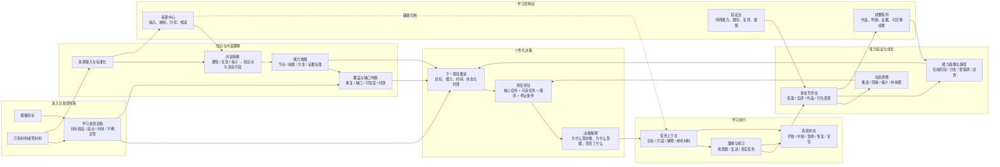
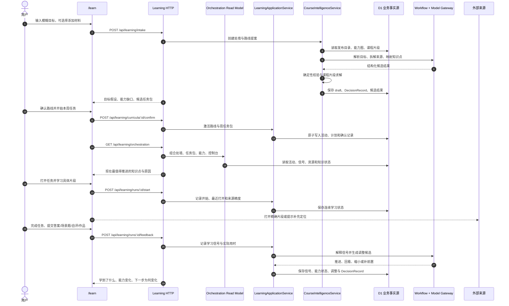

# Trellis 功能与技术架构图

> 状态：作品集内测版架构图源  
> 日期：2026-09-05  
> 说明：本文保留 Mermaid 迁移前图源；正式 Archify JSON/HTML 位于 `docs/architecture/archify/`

## 工具说明

Archify 官方仓库为 `https://github.com/tt-a1i/archify`。本文件中的 Mermaid 图是迁移前的审阅记录；正式图已经按 Archify typed JSON IR 生成，并通过 `validate`、`deliver` 和浏览器 `visual-check`。

## 一、功能架构

这张图表达 Trellis 的真实产品能力链，而不是把三个页面当作三个孤立模块。页面只是能力的入口，核心价值是持续回答“现在最值得推进什么，以及为什么”。



### 功能架构的页面映射

| 用户入口 | 承担的产品职责 | 不应承担的职责 |
|---|---|---|
| `/learn` 学习 | 展示当前处境、本周任务包、任务上下文、反馈和调整 | 让用户自己从课程名称中设计路线 |
| `/grow` 成长 | 展示能力模型、路径分支、阶段、证据和下个里程碑 | 只展示课程完成数或静态卡片目录 |
| `/workbench` 控制台 | 管理来源、验证候选能力、沉淀成果并连接学习上下文 | 充当“所有没地方放的链接”的杂物区 |
| `/internal/course-intelligence` | 审核内容解析、映射、模型运行和发布质量 | 作为普通用户学习入口 |

## 二、技术架构

技术图按“请求读模型”和“业务写入/智能决策”分开，避免把 LLM、Mastra 或页面误当成业务事实源。

```mermaid
flowchart TB
  subgraph Client[浏览器与用户入口]
    Learn[/learn\n学习任务包与连续学习]
    Grow[/grow\n能力模型与路径分支]
    Console[/workbench\n来源中心 / 验证台 / 成果]
    Review[/internal/course-intelligence\n内部内容与模型评审]
  end
  subgraph Transport[Next/Vinext HTTP 层]
    ReadRoutes[读路由\ncurrent / workspace / orchestration / intelligence]
    WriteRoutes[写路由\nintake / confirm / start / pause / feedback / evidence]
    SourceRoutes[来源路由\n资源保存 / 附加 / 分诊]
    ReviewRoutes[内部评审路由\ncandidate / model-runs / decisions]
  end
  subgraph Application[应用与领域模块]
    LearningService[LearningApplicationService\n状态机、活动、证据、周复盘]
    IntelligenceService[CourseIntelligenceService\n目录、课程版本、路线确认]
    Orchestration[LearningOrchestrationState\n学习处境 / 任务包 / 能力模型 / 控制台读模型]
    Solver[Curriculum Solver v3\n目标节点、前置闭包、课程片段与缺口]
    Adaptation[Decision Kernel\n信号解释、推进、回看、补前置、提案]
    ContentRules[内容与状态规则\n发布闸门、状态迁移、精度校验]
  end
  subgraph Intelligence[可替换智能层]
    Workflows[Mastra Workflows\n分析 / 编排 / 调整 / 来源演进]
    Gateway[Model Gateway\n结构化合同、grounding、超时、重试、缓存、trace]
    Primary[主模型 Provider\nQwen / OpenAI-compatible]
    Backup[备用模型 Provider\nGLM / OpenAI-compatible]
    Baseline[确定性 Baseline\n无模型密钥仍可运行]
  end
  subgraph Truth[业务事实与审计]
    Catalog[(D1 Published Catalog\n来源、课程版本、章节、节点映射)]
    Runtime[(D1 Learning Runtime\n路线、周计划、活动、信号、知识状态)]
    UserData[(D1 User Context\n资源、附件、个人来源覆盖)]
    Decisions[(D1 Decision Records\n提案、确认、调整、来源演进)]
    WorkflowStore[(Mastra D1Store\n可暂停工作流快照)]
  end
  subgraph Outside[外部系统]
    CourseSites[课程与公开来源\n外部 URL / 课程平台]
    HostedIdentity[ChatGPT 托管身份\n生产 owner 映射]
  end
  Learn --> ReadRoutes
  Grow --> ReadRoutes
  Console --> ReadRoutes
  Review --> ReviewRoutes
  Learn --> WriteRoutes
  Console --> SourceRoutes
  ReadRoutes --> Orchestration
  ReadRoutes --> LearningService
  WriteRoutes --> LearningService
  WriteRoutes --> IntelligenceService
  SourceRoutes --> LearningService
  ReviewRoutes --> IntelligenceService
  LearningService --> ContentRules
  LearningService --> Adaptation
  IntelligenceService --> Solver
  IntelligenceService --> ContentRules
  Orchestration --> LearningService
  Orchestration --> IntelligenceService
  Solver --> Catalog
  Adaptation --> Runtime
  IntelligenceService --> Workflows
  IntelligenceService --> Gateway
  Workflows --> WorkflowStore
  Gateway --> Primary
  Gateway --> Backup
  Gateway --> Baseline
  LearningService --> Runtime
  LearningService --> UserData
  LearningService --> Decisions
  IntelligenceService --> Catalog
  IntelligenceService --> Decisions
  ReadRoutes --> Runtime
  ReadRoutes --> UserData
  ReviewRoutes --> Decisions
  Learn -.打开精确片段.-> CourseSites
  SourceRoutes -.保存来源链接.-> CourseSites
  Transport -.可信身份.-> HostedIdentity
```

## 三、关键时序：一次“下一最佳学习任务”如何产生



## 四、架构判断

- D1 是用户路线、活动、证据、知识状态和决策记录的业务事实源；刷新、重启和跨设备都从这里恢复。
- `LearningOrchestrationState` 是面向页面的稳定读模型，隐藏多个存储和服务的拼装复杂度。
- `CourseIntelligenceService` 负责内容和路线候选；`LearningApplicationService` 负责学习执行、证据和状态迁移；二者通过读模型协作，不把课程标题直接当作学习路线。
- 模型和工作流只能产生结构化候选，发布闸门、状态机和用户确认决定什么能进入正式状态。
- 外部课程平台负责原始内容；Trellis 负责拆解、映射、优先级、任务上下文、反馈和能力证据，不复制受版权保护的全文。
- “智能”不等于一个聊天框，而是连续的判断链：处境判断 → 内容拆解 → 能力映射 → 优先级 → 任务组合 → 证据解释 → 后续调整。

## 五、当前限制

- 当前图源已对应本地实现；仍未生成 Archify 原生 PNG/SVG，因为指定仓库不可访问且本机无渲染命令。
- 来源中心、验证台和成果陈列目前主要由读模型投影；要支持跨刷新编辑、候选确认和外部账号持续同步，还需将这些投影升级为持久对象。
- 生产发布仍受远程 D1 迁移、生产 secrets、托管身份联调和线上 smoke 阻塞；本地图不代表已经部署上线。
