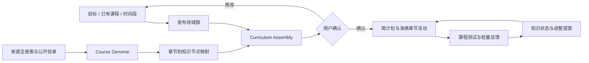

# Trellis Course Intelligence 架构

## 产品数据流



## 工程分层

```mermaid
flowchart TB
  UI[/learn · /grow · /workbench] --> API[Learning API]
  API --> CIS[CourseIntelligenceService]
  CIS --> RULES[确定性编排与发布检查]
  CIS --> GW[Model Gateway]
  GW --> LLM[内置 OpenAI-compatible provider]
  CIS --> CIR[Course Intelligence Repository]
  CIR --> D1[(D1: source / snapshot / graph / course / mapping / curriculum / run)]
  CIS --> BRIDGE[Learning Runtime Bridge]
  BRIDGE --> STORE[现有 plan / activity / evidence / progress store]
```

## 写入边界

- 模型只生成候选结构，不能直接发布领域图、课程版本或修改用户路线。
- Zod 负责输出结构；确定性检查负责引用、前置循环、映射置信度、课程数量和退出条件。
- 用户确认课程组合后，runtime bridge 才创建正式周计划和活动。
- 课程更新创建新版本及影响报告；已确认路线继续引用原判断，迁移需要用户确认。
- 未配置模型时，网关返回 baseline 模式；已发布数据可读，陌生材料保持 `needs_analysis`。

## 迁移关系

现有 D1、owner 隔离、周计划、活动、反馈和进度状态继续使用。旧 `CourseMaterialAnalysis`、固定 StagePath、关键词 Course Slicer、Mastra/Eval 展示与默认作品链不再进入新用户正式入口，后续可在确认无历史依赖后逐步删除。
