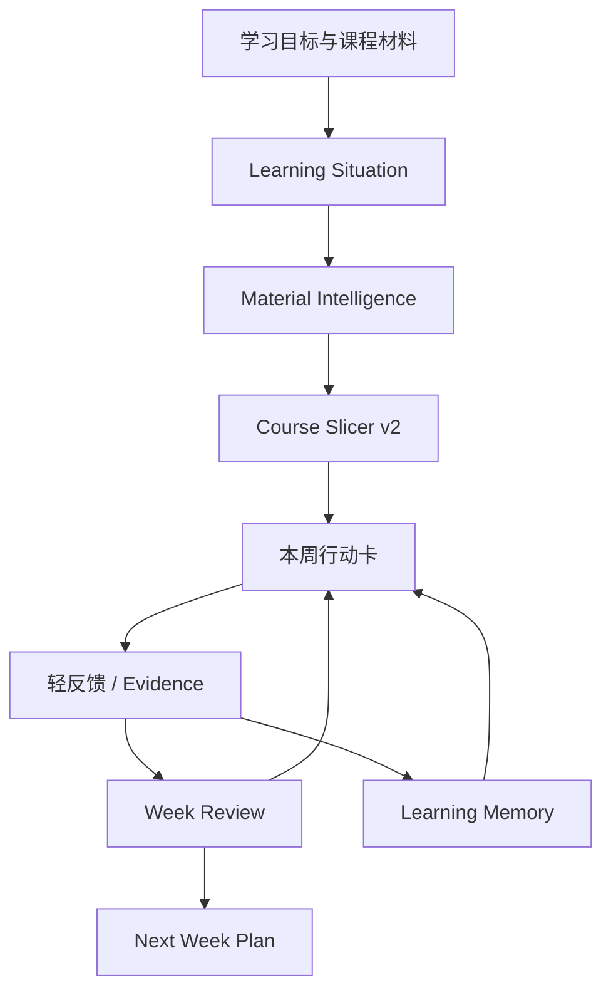
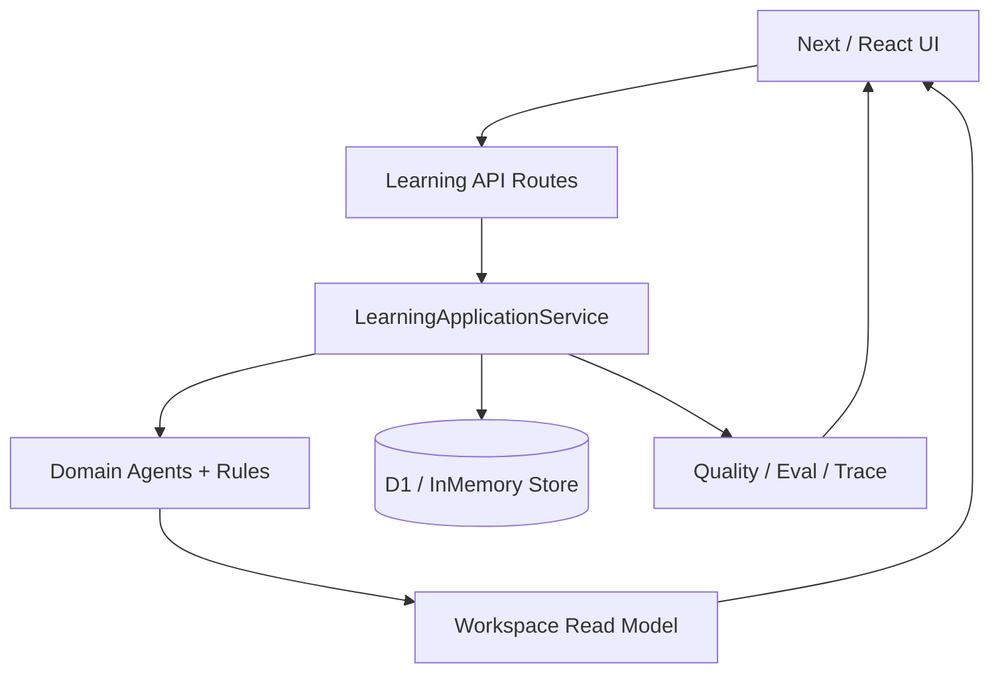
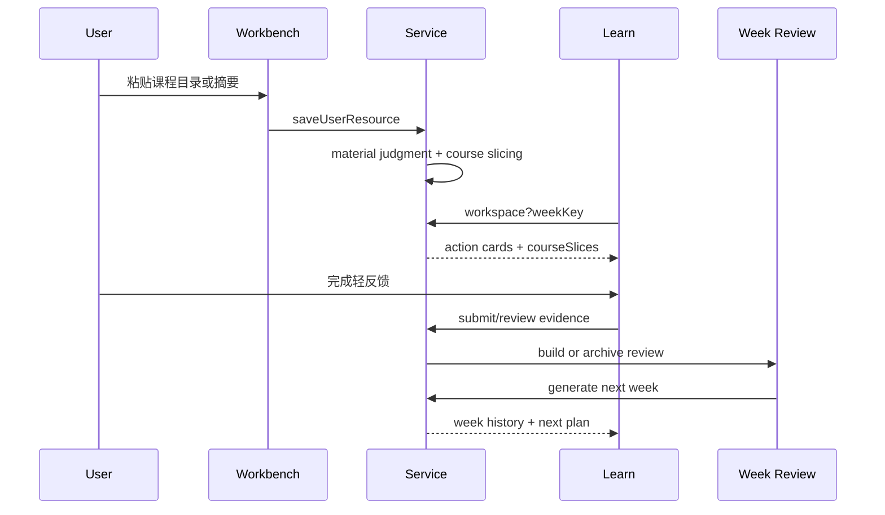

# Trellis 交付架构说明

更新日期：2026-08-30

## 功能架构

用户看到的是一条低启动链路：先判断，再切片，再行动，再留下轻反馈，再生成下一周。复杂维度留在系统读模型和折叠面板里，不要求初学者手动选择。

## 页面职责

`/learn` 是日用执行台：

- 新用户完成轻量 intake；
- 老用户看到本次最小推进、本周状态、本周只看片段和待处理事项；
- 行动抽屉展示具体课程片段、概念解释和轻反馈；
- 周历史、材料取舍、作品闭环和系统状态默认下沉。

`/workbench` 是材料入口：

- 接收用户粘贴的课程目录、视频目录、文章目录、摘要或关键片段；
- 展示材料是否映射到节点；
- 展示已切出几段、本周采用几段、后续/参考/跳过几段；
- 不做自动全文同步，不污染路线状态。

API / service 层负责判断和持久化：

- `/api/learning/workspace?weekKey=YYYY-Www` 返回指定周 workspace；
- `/api/learning/week-review` 返回即时或归档复盘，并可生成下一周；
- evidence、resources、activities 等接口保持正式状态写入；
- 无外部模型 Key 时规则版仍可运行。

## 技术架构

关键边界：

- `LearningApplicationService` 是唯一正式写入入口；
- domain agents 和 rules 做判断，但不绕过 service 写库；
- Mastra runtime 只做工程展示和 workflow trace，不接管正式学习状态；
- LLM 接入只增强长文本解析、概念解释、情景题改写和评审理由，不作为核心流程依赖。

## 数据流

## 可靠性边界

- 已完成证据、活动状态、作品版本和归档复盘不会因为生成下周而被清空；
- 指定 `weekKey` 可以读取历史周或未来周；
- 用户资源只有映射到节点后才进入活动；
- 高阶课程片段默认不会进入本周主线；
- delivery precheck 检查 README、部署说明、demo script、case study、架构说明、三周验收截图和 hosting 配置是否齐备。
