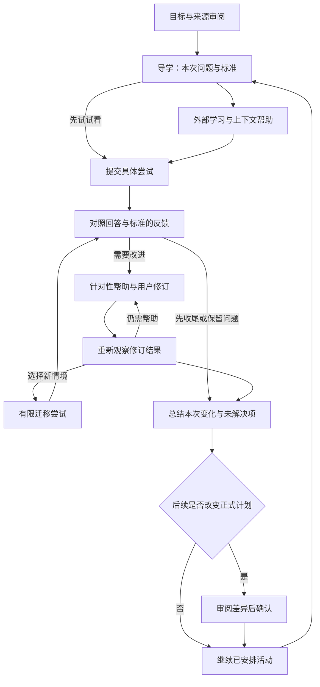

# Trellis 产品设计决策：以学习辅助闭环为中心

更新：2026-09-15。设计版本：学习辅助闭环与可实施规格版。源码核查基线：7c967f9。本文与[桌面交互规格](TRELLIS_DESKTOP_UPDATE_DESIGN_2026-09-14.md)共同定义下一版产品；文件名保留首次建立日期，避免跨设备入口失效。独立判断依据为当前源码、用户明确要求和注明来源的外部资料，不以以往评审结论作为事实证据。

本文负责产品价值、学习机制、AI 责任、取舍与评价；桌面规格负责页面、逐次点击、状态与验收。实现状态只看[PROJECT_STATUS](../engineering/PROJECT_STATUS.md)。本轮是重新设计，没有修改业务代码或交付已运行的新产品。

## 0. 先定义什么叫完整，再判断是否足以交给开发

结论：7c967f9 的设计可支持讨论学习方向和启动有限主题的设计，但不足以作为全部桌面优化的无歧义施工规格。主要缺口是需求追溯、直接学习竞品、内容分层、原子操作、入口与返回定位、旧功能迁移及可执行验收。本次补齐这些文档缺口；尚未完成连续交互原型、真实模型评测和新手试用，因此仍不能把“规格可审阅”说成“产品设计已经验证”。

高级 AI PM 水平由决策能否被证据支持、执行和证伪判断，不由术语、页数、点击数量或自评分判断。下面是项目交付标准，不冒称行业认证标准；门槛是为本产品选定的验收规则。

| 门 | 必须交付的证据；缺一不通过 | 为什么需要 | 7c967f9 文档的不足 | 本次处理与后续验证 |
|---|---|---|---|---|
| Q1 需求 | 用户/情境/困难/期望结果/证据类型/非目标，逐项编号 | 防止把功能想法当真实需求 | 有画像和假设，没有完整追溯 | 第 2 节补需求表与访谈任务；频率和付费意愿仍未验证 |
| Q2 竞争与替代 | 同一用户任务对比、可核实操作、来源、局限、采用/放弃原因 | 避免只抄卡片，或把竞品已有能力当独有价值 | 任务工具参照多，学习产品证据少 | 第 13 节与精选竞品证据；不声称登录实测 |
| Q3 定位和范围 | 谁用、何时用、何时不用、一个完整价值单元和边界 | 防止泛化成万能学习平台 | 主方向有，商业和服务边界欠明确 | 第 1、6、14 节明确有限辅助与经营假设 |
| Q4 学习与 AI | 目标—材料—任务—量规—反馈—修订一致；失败可继续；判断可纠正 | 防止 AI 只生成好看的文字 | 有规则，缺样例验收集和质量分级 | 第 8–11、21 节规定包和反馈评价；真实运行尚待验证 |
| Q5 信息架构与内容 | 每页一种主要任务；用户文案、情境指导、设计理由、工程信息分层 | 直接阻止内部解释、代码和操作混排 | 仍有 L0/L1/L2 等前台泄漏风险 | 第 20 节正反例、展示规则；桌面规格定页面职责 |
| Q6 完整交互 | 每个可见控件有唯一编号、前提、结果、状态、返回、异常和验收 | 防止开发者临场发明下半条链 | 合并了搜索/归档等不同动作，路由待定 | 桌面规格第 18–23 节补原子登记与继承规则；新增控件先登记 |
| Q7 交付与迁移 | 旧入口对应新去向；已保存数据保留；每包可独立验证 | 防止重做页面却出现两套产品 | 可复用基础说明不够完整 | 第 5、16 节与桌面迁移表；保留现有教学页事实 |
| Q8 设计验证 | 同一样例的连续可操作页面；新手无需主持解释完成主链与恢复 | 文字不能证明人能理解流程 | 只有文本演练与历史截图 | 提供逐屏内容和验收脚本；原型及新手验证仍是实施前的门 |
| Q9 运营与价值 | 质量负责人、问题处理、成本口径、价值指标和停止条件 | 防止上线后无法维持辅助质量 | 有原则，缺具体执行口径 | 第 14、15、21 节补责任与门槛；不虚构人员和数据 |

**使用方式：** 需求与行为规格可以进入设计评审和原型制作；每个切片通过 Q8 的连续页面评审后再把页面方案作为实现依据。代码、线上和用户效果另验。整体不能用一个平均分放行：丢答案、伪造来源、未确认改计划、无动作的核心按钮任一存在，即使其它项目很好也不能验收。

### 0.1 “每一次点击”的可检查定义

“每次”指批准范围内所有页面和状态中每一种用户可触发动作：导航、展开、选择、输入、提交、取消、返回、重试、修改和键盘等价操作。重复列表项使用同一行为规格加对象 ID；不为每一行重复编规格。一次点击不能同时表示两个不同意图。

验收时从实际页面反向盘点控件，而不是只按文档顺着点：可见控件集合与规格登记集合应一一对应；装饰和只读状态不做成按钮。任何“开发时看着办”的业务后果都算设计缺口。控件覆盖率可检查设计遗漏，但不能证明学习有效。

## 1. 核心决定：把辅助学习的价值放进主流程

用户最新要求：点击次数不是主要问题，流程链路必须清楚，最重要的是体现辅助学习价值。设计优先级因此调整为：

1. 每个环节都解释“为什么做、怎样做、做到什么程度、接下来是什么”。
2. 用户得到与当前目标、材料和作答相关的指导，而不只是任务和记录。
3. 反馈必须能引导一次具体修改或练习，修改后有重新观察的机会。
4. 下一步根据实际证据和用户约束解释，用户能够接受、纠正或暂缓。
5. 点击数量是负担诊断的辅助指标，不作为方案选择或验收的主目标。

### 1.1 本次改变了什么

| 当前/前版倾向 | 新设计 | 学习价值与代价 |
|---|---|---|
| 生成路线后主要是打开外链、记录完成 | 每个受支持学习活动具有导学、外部学习、尝试、反馈、修订和收尾 | 用户能够把看过的内容用于一个小任务；需要明确的内容质量门 |
| 反馈是流程末端的一段结果 | 反馈指出具体问题，并把用户带回可修改的答案或针对性例子 | 反馈产生下一次行动；不是写完建议就结束 |
| 帮助是用户主动找的附加功能 | 在导学、尝试和反馈处提供带上下文的帮助 | 新手不用重新组织全部问题；要控制越界解释与答案泄露 |
| 成长主要呈现节点与状态 | 展示具体作品/回答如何改进、仍缺什么、下一步为何 | 进展可以解释；有限表现不能包装为全面掌握 |
| 第一开发包是列表、完成和恢复 | 第一包是一个受支持目标的完整辅助学习过程 | 暂缓广度，先证明一条学习价值链 |
| 200 条操作作为交付中心 | 操作从学习任务、状态与价值流中推导 | 可按流程验证；操作数量不代表产品成熟度 |

明确保留：来源边界、未知用时、正式状态与证据分离、版本保护、跨设备正式状态恢复。明确改变：学习活动不再主要放在窄抽屉；实际学习与作答进入完整的学习空间，便于并排查看材料、自己的回答和反馈。

### 1.2 产品一句话

Trellis 帮助 AI 学习新手从目标和材料出发，在每次学习中理解重点、尝试应用、获得有依据的反馈、完成修订，并据此选择下一步。

这是拟实现的价值承诺，不是当前已达到的效果。教学仍主要由外部课程提供。Trellis 的辅助限于与活动目标相关的导学、解释、例子、小练习、有限检查与复习，不扩大为完整课程平台或通用聊天首页。

## 2. 首要用户、场景和价值假设

### 2.1 选择谁、为何选择

首期优化有一个 AI 学习方向、缺少学习规划与应用经验的人。允许无材料、少量材料和已有课程；不要求每天登录、固定每日时间或愿意填很多表。

优先测试三个场景：不知道从哪里开始；课程看懂却不会用；中断或做错之后不知道怎么继续。这三个场景可以贯穿同一过程，适合检验辅助价值是否连续。

暂缓企业培训管理、跨领域万能导师、多目标重度项目管理、完整职业咨询与自动作品认证。先支持有限能力主题，优先核验现有“AI 能力边界/问题定义/判断依据/交互回退”相关素材，不宣传覆盖全部 AI PM 学习。

### 2.2 必须验证的假设

| 假设 | 怎么验证 | 不成立时怎么改 |
|---|---|---|
| 明确的导学问题能帮助用户有目的地使用外部课程 | 学后让用户复述重点并完成相关任务，比较无导学场景 | 改导学问题或材料，不继续增加说明文字 |
| 具体反馈加修订入口能改善用户回答 | 比较第一次和修订后回答，记录用户采用了哪条反馈 | 反馈变成更小的动作或换例子，检查是否只给空泛评价 |
| 渐进帮助比直接生成答案更能支持独立尝试 | 区分看提示、看示例与独立迁移结果 | 调整帮助层级，不强迫所有人按同一路径 |
| 学习记录能够改善下一次起点 | 中断后恢复同一问题、作答和下一动作 | 改恢复摘要与定位，不只保存页面 URL |
| 无材料和有材料用户都可能获益 | 两组分别观察首次获得实际学习帮助的过程 | 收窄支持范围或改善资源入口，不凭直觉排除一类用户 |
| 用户愿意多走有学习价值的步骤 | 询问各步骤为何有用、观察完成与跳过原因 | 删重复步骤而保留必要思考，不能把少点击作为唯一答案 |

首次价值是用户作出一个更有依据的选择，或完成一次具体的理解/修订。持续价值是这些积累能帮助后续学习，而非每次回到一张空白表单。没有用户数据时不宣称任何使用频率、净收益或留存已经成立。

### 2.3 需求追溯：从困难到可观察结果

证据标签：U 是本次用户明确要求；C 是当前源码可观察事实；H 是待验证的用户假设；E 是外部产品或研究资料。U 能确定本项目设计约束，不能证明全部新手具有同样困难；C 能证明实现行为，不能单凭代码断言用户感受。

| 需求 | 情境和期望结果 | 当前依据与未知 | 设计决定与点击组 | 验收结果 |
|---|---|---|---|---|
| N01 找到起点 | 有宽目标但不知道先学什么；先明确一个能做的事 | U 要辅助学习；H 不知道起点的普遍程度未研究 | 可编辑目标、约束、可选有限尝试、路线审阅；B | 用户能说出第一活动怎样服务目标；无材料有诚实起点 |
| N02 知道本次任务 | 进入活动后清楚为什么学、看哪里、结束时做什么 | U 流程混乱；C 任务合同已有这些字段但分散 | 同一目标贯穿准备与学习；P/L | 不靠主持解释，指出本次问题、来源范围和下一动作 |
| N03 得到针对性帮助 | 看不懂一个概念或不知道如何应用 | U 辅助价值；C 有有限补充单元；H 帮助形式偏好未知 | 片段解释、渐进提示、对照例子；L/T | 帮助带当前上下文，能回原回答，不必重述全部目标 |
| N04 把反馈用于改进 | 完成尝试后知道哪句有问题、如何改 | C 有选择题反馈；开放答案修订链缺失 | 引用—标准—建议—用户修订—再观察；F/R | 能找到并修改对应内容；原答案仍可回看 |
| N05 中断后接着学 | 时间不足、退出或换设备后回到未完成问题 | U 重视另一 PC；C 本机草稿与账号提交分离 | 保存范围、暂停与恢复；X | 已同步内容恢复同一活动/答案/问题；未同步内容不假装存在 |
| N06 信任依据与边界 | 判断 AI 建议来自哪里，错了能反驳 | U 要客观；C 有来源/版本和有限评价 | 依据按需展开、异议、无法评价降级；M/F/X | 不编造引用、分数或用户误解；异议不覆盖原反馈 |
| N07 选择合理下一步 | 学完、没学完或遇到困难后可继续 | U 要清楚链路；C 已有调整提案基础 | 会内帮助直接获得，计划变化审阅后采用；E/W | 用户能区分“去看看”与“修改安排”，知道什么会变 |
| N08 看清学习变化 | 回顾自己会做什么、仍缺什么 | C 成长分支点击只改筛选；证据显示不够具体 | 按活动展示回答和修订，领域图作补充；G | 完成记录、自报和有限表现可区分，能回到原活动 |
| N09 管理材料而非后台 | 保存链接后知道读到什么、在哪使用 | C 保存/分析/采用已有；工作台混入测试与成果叙事 | 材料状态和用途、活动回链；M | 保存不等于分析，分析不等于加入路线；每个状态有真实下一步 |
| N10 看得懂产品 | 不需要学习内部模型、术语或工程流程 | U 明确反对内部解释/代码/指导/功能混排；C shell/工作台文案 | 第 20 节内容分层、页面控件清单 | 核心流程无内部字段和无关宣言；指导直接服务当前动作 |

### 2.4 需求验证计划，而不是伪造访谈结论

招募建议：6–8 名符合首期范围的新手，分有课程/无课程、尝试过但不会用/尚未开始，至少包含真实中断经历。记录 AI 基础和外部学习习惯，不用职业头衔推断能力。参与者可跳过题目；不以不愿作答判断懒惰。

先问最近一次真实学习：“为什么学、用了什么、在哪停下、如何判断学会、遇到困难怎么办”；允许参与者自愿展示非敏感材料或记录。再让其独立完成桌面规格中的情境任务。不要问“你是不是需要 AI 辅导”来制造支持，也不要先介绍设计理念再测试能否理解。

产出是匿名问题观察表：情境、原话或行为、影响、发生条件、替代方式、对应 N 编号、反例。一次访谈只产生线索，不能产出市场比例。若用户更需要课程选择而非作答反馈，收窄辅助包并重排首页；若反馈使用困难，先修具体提示和返回链，而不是加功能入口。

优先级依据为：学习价值链是否断裂、是否影响已保存事实、是否有足够内容支持、是否有便宜可行的验证方式。没有影响规模数据时不伪造 RICE 分数或预计转化提升。

## 3. 学习价值链：每一环节都必须有产出和去向

主流程是：确定要能做什么 → 准备本次学习 → 使用来源学习并获得帮助 → 做一次尝试 → 看懂反馈 → 修改或补学 → 用结果选择下一步 → 下次恢复。

图中循环由用户选择，允许随时保存暂停或收尾；没有自动反复出题或强迫通过才能离开的循环。

| 环节 | 用户的问题 | Trellis 的辅助 | 用户产出 | 产出去哪里 |
|---|---|---|---|---|
| 目标界定 | 我到底要达到什么 | 把宽目标拆为可观察结果，允许纠正 | 已确认目标与约束 | 路线、活动目标与评价标准 |
| 起点与路线 | 我该从哪开始 | 自述基础、可选小尝试、来源取舍与缺口 | 起点假设或有限起点观察 | 导学深度与建议顺序 |
| 导学 | 这次重点看什么 | 本次问题、材料范围、关键术语、结束标准 | 用户知道此次目的 | 外部学习与后续尝试 |
| 学习与帮助 | 内容看不懂或不知如何使用 | 来源定位、按片段解释、正反例和针对性提示 | 位置、问题、可选学习笔记 | 尝试时的上下文与帮助记录 |
| 尝试 | 我能不能用出来 | 与目标一致的小任务，清楚的要求和评价标准 | 具体答案、选择或成果片段 | 评价与成长记录 |
| 反馈 | 我具体哪里有问题 | 对照标准引用回答，说明成立与缺口 | 用户选择要处理的问题 | 修订编辑器或补学路径 |
| 修订与再尝试 | 我怎样改善 | 提示、对应例子、原材料定位、新的有限任务 | 修订答案或新场景表现 | 重新评价与下一步建议 |
| 收尾与后续 | 下一步为什么这样安排 | 汇总变化、帮助程度、未解决项与建议 | 记录、待处理问题、可确认安排 | 成长、复习、下次学习 |

不能只用“已生成反馈”标记闭环完成。用户至少要能知道反馈指向哪个回答、如何处理、处理后在哪里继续；也可以选择暂不处理，系统应保留未解决项。

### 3.1 流程分支

- 已熟悉内容：先做起点尝试，再决定是否略过导学。不是自报熟悉就自动认定掌握。
- 无时间继续：暂停并保存当前阶段、回答和下一步，不强迫完成所有步骤。
- 只想记录外部学习：可记录，标明尚未观察应用表现；不把快记路径当默认的完整辅助体验。
- 来源不足：告诉用户当前能提供的是规划、有限解释还是完整辅助，不伪造课程内容。
- 多次仍不理解：允许换例子、回原课程、缩小目标、提出补前置；不无限循环同一题。
- 明显与 AI 无关的问题：如资源登录失败，处理访问问题，不诊断为能力不足。

## 4. 学习机制的依据与边界

本轮补充查阅官方教育研究资料。它们用于支持设计假设，不证明成人自学 AI 的具体产品效果，更不证明某种 UI 最优。

- IES 学习指南建议将示例与练习交替、使用提取练习、提出解释性问题，并对不同建议标注不同证据等级。本文据此设计“示例可看、必须区分有帮助练习与新情境尝试”，不推导每次学习都必须测验或所有提示都同等有效。[IES 官方指南](https://ies.ed.gov/ncee/wwc/PracticeGuide/1)
- EEF 指南强调反馈质量与帮助缩小学习差距，并说明反馈并非总有正面作用；相关建议包含给学习者落实反馈的机会。主要情境是学校教育和教师反馈，不能直接当作成人 AI 助教效果证据。本文据此把“修改并再尝试”放进设计，而不是只提供评价文本。[EEF 指南](https://educationendowmentfoundation.org.uk/education-evidence/guidance-reports/feedback)、[反馈证据综述](https://educationendowmentfoundation.org.uk/education-evidence/teaching-learning-toolkit/feedback)

本次产品推导：每次增加的互动必须帮助用户形成理解、尝试、修订或选择；单纯确认一个无后果的字段不具有同等价值。小练习服务于学习与有限观察，不用于给整个用户评分。

## 5. 与现有实现的差距和可复用基础

本轮核查源代码，没有运行新版交互或真实模型。现有页面中存在什么，与未来学习空间是否完成，分别报告。

| 核查对象 | 现有事实 | 本次复用与缺口 |
|---|---|---|
| [learning-program](../../lib/learning/intelligence/learning-program.ts) | 已有目标、讲解、例子、练习、量规和两组检查的内容结构；标明原创与课程引用边界 | 可以作为有限辅助包基础，仍需逐项校验质量及与活动目标的匹配 |
| [program-bindings](../../lib/learning/intelligence/program-bindings.ts) | 已有四个明确能力节点到补充单元的映射 | 从受支持节点做第一切片；不能宣传任意材料都可获得同等辅导 |
| [内部补充页](../../app/internal/learning-program/page.tsx) | 存在独立补充教学/检查页面 | 不能把内部入口直接曝光即称产品整合；需接入当前活动、返回与作答状态 |
| [当前活动教学页](../../app/learn/activity/%5Bid%5D/page.tsx) | 已有按活动进入的讲解、例子、练习笔记、两组选择题、逐题反馈、历史与账号提交；工作台有真实入口 | 不是“完全没有辅助学习”；复用题目评价和保存能力，补统一导航、开放作答版本、逐项修订与恢复阶段；当前笔记明确尚未开放评审 |
| [scenario-bank](../../lib/learning/intelligence/scenario-bank.ts) | 有节点相关情境题、理由和量规 | 可做有限检查；重复看到答案的题不能算新的独立验证 |
| [orchestration](../../lib/learning/intelligence/orchestration.ts) | 活动已有目标、预期结果、停止条件、失败动作与来源字段 | 作为导学和过程组织输入；仅展示字段不等于给出有效帮助 |
| [decision-kernel](../../lib/learning/intelligence/decision-kernel.ts) | 已区分完成、自报、情境与 program_check；卡点含关键词规则 | 保留确定性基础；关键词只能给候选处理，不能自动诊断知识缺陷 |
| [学习页](../../app/learn/page.tsx) | 多区域呈现活动，反馈综合表单，实际用时默认 30 | 重组为路线入口与完整学习空间；未知用时保持真实 |
| [服务](../../lib/learning/intelligence/service.ts) | 有版本、信号保存、幂等与冲突校验；self_report 已存在 | 复用保护，补作答版本、帮助使用、反馈引用与修订闭环；不重复建设同名服务 |

本轮未证明现有内容足够准确、题目区分度足够或开放回答评价足够稳定。首包上线前要审阅实际辅助包，不因源码中有 lesson/practice 字段就认定学习价值已交付。

### 5.1 当前问题必须落实到用户后果

| 当前源码事实 | 用户可能受到的影响（需界面/试用确认） | 优化方式和保留部分 |
|---|---|---|
| [导航壳](../../app/_components/shell.tsx)常驻“可信的动态学习编排”“学习处境编排”与内部设计宣言 | 第一次进入先读系统怎么想，而非自己要做什么 | 保留三入口，移除宣言；按页面显示具体目标与下一动作 |
| [工作台](../../app/workbench/page.tsx)主区处理材料，另有折叠区承载来源中心、测试机、成果陈列室，以及仅说明型高级设置 | 折叠已降低首屏负担，但展开后的名称仍暗示可操作，部分卡片仅叙述 | 保留材料主区；检查回活动、成果回成长；没有设置能力就无设置入口 |
| [活动教学页](../../app/learn/activity/%5Bid%5D/page.tsx)已有讲解与检查，但采用独立长页和本机草稿 | 能做检查，但学习首页—课程—反馈—修改的上下文不统一 | 保留已发布内容/历史，以同活动学习空间组织过程，不删旧答案 |
| [学习页](../../app/learn/page.tsx)综合自报/测验/完成/用时；用时默认 30 | 用户可能把填表当学习，或把默认值当实际记录 | 先展示本次结果，分别记录实际行为与表现；用时未知不补猜值 |
| [成长页](../../app/grow/page.tsx)不同分支按钮均执行 setFilter("all") | 点具体方向却看全部内容，无法预期点击后果 | 分支定位具体范围；无详情时只读，不伪装按钮 |
| 任务合同逐项输出停止条件、失败动作、precision 等值 | 后台模型字段可能压过任务指导 | 用经过定义的页面文案与显示映射呈现；源数据保留作依据，不直接铺满 UI |

“呈现差”不等于底层所有工作无效。上述重组必须保留活动 ID、来源和已保存提交的连续性。不得将文档重命名或减少卡片数量当作学习闭环已重做。

## 6. 产品范围与辅助服务等级

### 6.1 避免把“外部课程为主”理解成“产品只负责跳转”

外部课程负责主要教学。Trellis 在用户目标与课程之间补充：学前重点、材料适用性、具体问题的解释、学习后的应用尝试、反馈与修订、后续建议。辅助围绕活动，内容有来源或明确标为 Trellis 原创，覆盖有限。

| 支持等级 | 可提供 | 不应宣称 |
|---|---|---|
| L0 仅定位/规划 | 目标与材料链接、目录范围、学习位置和记录 | 已阅读正文、可评价任意课程内容 |
| L1 有依据解释 | 基于已读片段的摘要、术语、对照和问题澄清 | 全课程教学覆盖、独立能力验证 |
| L2 完整辅助活动 | 经审阅的导学、练习、量规、分层帮助、修订与复试 | 无限制导师、全面能力认证 |
| L3 阶段结果回顾 | 在已支持活动上汇总证据、提出复习和调整 | 普适掌握度或学习效果保证 |

以上 L0–L3 仅是内部设计分类，不渲染为产品标签、用户等级或付费身份。路线审阅展示具体能力：“可打开材料并记进度”“可基于已读片段解释”“含导学、尝试和反馈”；阶段回顾说明记录范围。材料不足提前解释实际影响，不能让用户进入后才发现所有功能都是空的。

### 6.2 优先级

第一切片选择一个 L2 主题，完成整条链，保留 L0/L1 的诚实路径。先不拓展全 AI 学科、实时语音导师、无边界聊天、开放作品自动认证、复杂笔记系统或手机专项。

辅助增加的步骤有明确学习目的，可以保留。重复填写系统已经知道的目标、让用户操作后台步骤或不清楚后果的确认，应消除。

## 7. 核心体验：以一次学习为组织单位

### 7.1 页面职责

| 入口 | 对象与任务 | 关键连接 |
|---|---|---|
| 学习首页 | 当前路线、当前学习与建议下一步；解释为什么 | 进入学习空间，查看路线与周安排 |
| 学习空间 | 同一活动的导学、来源、尝试、反馈和修订 | 全宽主区域；带阶段导航和恢复点 |
| 成长 | 我的回答/成果怎样变化、有限证据与尚待解决问题 | 回到对应活动或审阅下一步 |
| 工作台 | 材料、实际读取范围、可提供的辅助与使用关系 | 创建/更新路线候选，不直接改正式路线 |
| 路线/周审阅 | 目标、顺序、来源、辅助能力、预算和变更 | 确认后进入正式学习 |

学习空间不是第四个一级导航，也不是通用聊天页。它是从学习或成长进入的活动工作区域。短信息可用侧栏，长文本作答、反馈对照和修订采用主区域，避免窄抽屉迫使用户不断切换。

### 7.2 学习空间结构

    路线 / 阶段 / 本次活动                返回路线  暂停
    目标：本次结束时，你应能做……
    准备 → 学习 → 尝试 → 反馈与改进 → 收尾
    ---------------------------------------------------
    当前任务 / 材料范围 / 作答编辑器      需要帮助
    或原回答与反馈对照                  来源与限制
    ---------------------------------------------------
    当前状态、保存范围                  明确的下一步按钮

阶段条表达过程位置，不表示必须一次走完。已发生的步骤可回看；未满足进入条件的步骤说明原因。每页说明“为什么在这里”“本页需要做什么”“完成后去哪”，用户可以有目的地多点击。

辅助栏随当前任务变化：学前术语、学习时片段解释、尝试时提示、反馈时修订建议。不能同时常驻十张不同工具卡。

## 8. 设计一个真正可交付的辅助活动包

每个 L2 活动必须具备下表内容并经审阅，不以自动填满字段替代质量。

| 内容 | 具体要求 | 为什么必需 |
|---|---|---|
| 学习结果 | 一个或少量可观察动作，如区分两种方案并解释条件 | 为材料、尝试和反馈提供同一判断目标 |
| 起点依据 | 用户自述/既有表现/未知，明确来源 | 决定帮助深度，不伪造诊断 |
| 来源范围 | 实际可读内容、位置、访问要求、版本 | 防止导学脱离材料 |
| 导学问题 | 学习时应该带着什么问题，不直接泄露后测答案 | 将阅读转成有目的的学习 |
| 核心解释 | 正确、有限，引用或原创身份明确 | 帮助用户跨过当前障碍 |
| 示例与反例 | 对照一个关键区别，说明适用边界 | 避免只有抽象定义 |
| 尝试任务 | 能产出可观察答案、与学习结果一致 | 不能用一句“我懂了”代替 |
| 评价标准 | 用户可提前看到，各项能找到回答中的依据 | 让反馈可解释和可申诉 |
| 帮助层级 | 提示方向 → 指出关注点 → 对照示例；用户可直接选择 | 保留学习选择，同时记录帮助条件 |
| 修订任务 | 针对当前缺口提出具体要修改的部分 | 反馈后有可执行动作 |
| 再尝试 | 同目标、不同情境，避免原题背答案 | 观察有限迁移而非机械复述 |
| 收尾与后续 | 本次变化、仍缺什么、下一步及原因 | 与路线、成长、复习衔接 |

同一包的目标、导学、练习、量规和反馈规则必须一致。如果题目测到的是术语记忆，就不能用它证明产品方案判断能力。出现冲突应阻止该包作为 L2 发布，仍可保留明确的 L0/L1 来源入口。

## 9. 一个完整样例：从“全部交给 AI”到能解释取舍

以下是设计夹具，不是用户事实或真实模型运行结果。Trellis 示例与题目为本报告构造；课程内容需在实施时绑定已核验来源，不把示例冒充原课程内容。

### 9.1 目标与导学

用户目标：为一个小型工作工具判断哪些环节适合 AI，并说明失败后如何处理。

本次活动结果：能够区分明确规则与需要从样本归纳的任务，提出一个具体失败条件和可操作回退。评价只覆盖这三项，不代表已经掌握完整 AI 产品设计。

导学页：
- 本次问题：什么时候规则就足够，什么时候需要模型？
- 学习范围：已核验材料的相关片段；只有主页时明确手动定位。
- 带着两个问题学习：判断条件是否已经明确？输入变化会怎样影响结果？
- 学后尝试：对一个新工作场景写三句话；标准提前可见。
- 主动作：开始这次学习；熟悉者可选先尝试，不强迫重新观看。

### 9.2 用户实际尝试

任务：一个工具需要“超过固定金额转人工”和“从不同版式票据中提取字段”。请分别选择规则或模型，解释理由，并提出一个失败条件和回退。

第一次回答（合成）：“两个都用 AI，比较智能。失败时重试。”

反馈不能只是“需要补前置”或“理解不足”。合格反馈：

| 标准 | 引用用户回答 | 具体反馈 | 下一动作 |
|---|---|---|---|
| 区分规则与模型 | “两个都用 AI” | 固定金额的判断条件已经给定。需要说明为何还要模型，或者改为规则 | 修改第一句：分别指出两个任务的判断条件 |
| 识别失败条件 | 没有给出输入条件 | “失败”还无法指导验证。请选择如图像模糊、版式变化或字段缺失中的具体情境 | 为票据任务补一个可观察条件 |
| 可执行回退 | “重试” | 重试不一定解决持续模糊的输入；需要说明何时请求补充或转人工核对 | 补充一次明确的回退动作 |

反馈保留成立之处与无法判断部分。没有回答依据时不编造用户误解；只能说缺少所需说明。

### 9.3 辅助怎样连接到修改

用户点击第一条“帮我分清”：
1. 展示简短对照：条件明确的阈值规则，与输入多变的字段识别。
2. 允许“看一个其他例子”：固定库存提醒与从投诉文本识别主题。
3. 用户可看完整示例，系统记录该次帮助使用，不强迫先看完所有层级。
4. 点击“回到我的回答”，返回原文编辑器，光标定位待修改部分。

用户修订：“固定金额用规则，因为条件已确定；不同版式票据识别可考虑模型。模糊图像可能识别错误，需要提示重新上传，仍无法确认时转人工核对。”

系统对修订版本逐项回应：
- 本次回答已经明确两种任务的区别。
- 提出了具体输入风险。
- 给出了与该风险相关的处理方式。
- 这是在当前例题与帮助条件下的表现；可做新情境尝试，也可先收尾。

此时有明确的正向结果，不应只显示一串“尚未验证”。用户应知道自己具体改进了什么。

### 9.4 再尝试与下一步

再尝试换成新情境：固定日期提醒与投诉分类，要求独立解释条件和错误处理。若用户已看过此情境示例，则必须换另一经审阅情境或标记为练习，不能当作未见检查。

根据结果：
- 能解释关键区别但回退仍空泛：建议继续“交互与回退”相关活动，并说明延续关系。
- 规则与模型仍混淆：建议短补学与不同例子，保留当前目标，不自动全面改路线。
- 用户没有时间：保存两版回答、问题与建议；下次从未处理反馈恢复。
- 用户只登记完成：记录真实行动，并说明未观察独立尝试，不阻止其自行继续。
- 需要新增正式活动或改变本周承诺：展示影响，确认后写入计划。

### 9.5 这个样例如何证明设计差异

用户不仅得到了一个任务，还获得问题引导、具体纠错、可修改的答案、一次重新尝试和有理由的后续选择。增加的点击对应真实学习动作。产品价值需用回答改善和新情境表现验证，不能用点了“完成”来证明。

## 10. AI 产品责任：输入、判断、输出、行动和校验

### 10.1 场景约定

| AI 任务 | 允许输入 | 输出 | 必须校验 | 失败路径 |
|---|---|---|---|---|
| 目标澄清 | 用户原文、已提供约束 | 可编辑理解、关键歧义 | 不发明基础与职业事实 | 保留原文，明确有限目标 |
| 导学准备 | 经审阅目标、来源范围、起点依据 | 本次重点与观察问题 | 目标一致、来源真实、不泄漏未见题答案 | 使用已发布导学或只提供来源定位 |
| 片段解释 | 用户选中片段、相关上下文、当前问题 | 解释、例子与范围说明 | 引用存在；生成例子标原创 | 明示无法可靠解释，回原材料或请求少量上下文 |
| 提示 | 当前尝试、量规、帮助历史 | 一个可执行关注点 | 不把未表达内容当作用户错误；不自动改答案 | 已审阅静态提示或允许查看示例 |
| 回答反馈 | 作答版本、任务版本、量规、帮助条件 | 逐项结论、回答引用、修订动作 | 依据匹配、结论范围、严重不确定性 | 保留答案，提供自检量规，暂不生成判断 |
| 修订比较 | 原答案、新答案、原反馈 | 哪些改变成立、哪些仍缺 | 新反馈必须评价新版本；不改旧结论 | 展示两版原文，待重试 |
| 后续建议 | 有限表现、未处理问题、路线与预算 | 继续/补学/复习/调整建议及理由 | 正式变更必须经确认 | 使用既定路线与用户选择，标缺少新判断 |

内部输出至少有：inputVersion、taskVersion、answerVersion、sourceRefs、criterionResults、learnerQuotes、uncertainties、suggestedNextActions、assistanceUsed。字段用于追溯与校验，不直接全部展示给用户。

### 10.2 评价不能代替学习者作答

默认保留用户原文，不自动把 AI 改写成用户成果。用户请求完整示例时可以展示，但标为示例，后续活动区分“看过示例的练习”与“未见情境的尝试”。

反馈是教学建议，不输出无依据的人格/能力标签或总体分数。有效反馈可以明确“这一条符合标准”，同时限制其适用范围。不确定时保留用户作答并说明需要更多依据，不必把所有内容退回泛泛免责声明。

### 10.3 结果校验与建议级别

- 来源引用必须来自当前可用材料版本。
- 引用用户回答必须能在对应作答中找到，不能补写其意图。
- 量规项与任务目标映射缺失时停止能力性判断。
- 已看过答案、提示或原题时，记录帮助条件，不称为全新独立验证。
- 模型自报的 confidence 不当作经过校准的正确概率。
- 简短提示、切换解释和当前回答修订不改正式计划，可由用户点击获得。
- 插入补前置、替换材料、改变周预算和重要能力状态形成提案，审阅后生效。
- 不因一句“看不懂”自动诊断前置缺口；先基于具体问题或尝试给有边界的建议。

## 11. 学习状态、证据与恢复

### 11.1 四类状态分开

| 维度 | 示例 | 用途 |
|---|---|---|
| 行动状态 | 未开始、进行中、暂停、已记录完成 | 反映用户执行与恢复 |
| 会内阶段 | 准备、学习、尝试、反馈/修订、收尾 | 说明当前正在做什么 |
| 表现记录 | 自报、带提示练习、当前题符合标准、新情境有限表现 | 说明判断的条件与范围 |
| 正式计划状态 | 候选、已确认、已过期、历史版本 | 控制后续承诺 |

会内阶段不是新增五份业务活动。优先在同一活动下保存会话、作答版本与恢复点；是否新增表由实现切片决定。实际数据仍以 D1 为业务事实源，Mastra 负责工作流状态，不能用工作流快照替代学习记录。

### 11.2 最低保存内容

活动与任务版本、当前阶段、来源位置、未提交草稿范围、已提交回答、帮助使用、反馈版本、修订关系、未处理问题、用户接受的下一步。

每次保存响应未知时查询原提交；两设备冲突保留两边输入供选择。登录失效不退回其他 owner。新设备恢复服务端正式记录；未同步的本机草稿明确不能跨设备出现。现有代码未必支持全部会内状态，属于需补齐差距。

### 11.3 完成和收尾

收尾页允许：
- 保存本次学习记录并继续建议活动。
- 保留问题，稍后再练。
- 记录已完成外部学习，但未做应用尝试。

每个选项都说明保存结果。完成记录不要求通过所有练习，学习者可以跳过检查；跳过后的表现保持未知。系统不能把“不做题”解释为学不会，也不能将“点了下一步”解释为掌握。

用时为可选近似记录，默认未知。检查与练习的投入纳入活动预计预算，不能在“30 分钟课程”之外偷偷增加大量任务而仍称预计 30 分钟。

## 12. 路线、材料、成长与周安排怎样接入主链

### 12.1 路线审阅

每阶段展示预期结果、来源选择、首批活动、可用辅助、前置与缺口。用户在采用前就知道“哪些活动有导学、尝试和反馈，哪些仅支持定位与记录”；不显示内部服务等级代号。

修改材料偏好只修改草稿；更新后查看差异再采用。已有正式活动与回答不能被新候选覆盖。预算继续采用周区间和 15 分钟粒度，不引入每日打卡。

### 12.2 材料工作台

保存 → 读取与范围确认 → 分析候选 → 审阅可用内容 → 进入路线候选 → 生成支持程度明确的学习活动。

“材料已分析”不等于“有完整辅导包”。主题、来源与内容质量门不满足时只能 L0/L1。多片段操作可以批量，但用户选择与版本保护必须保持。已有引用随分析更新不静默改写。

### 12.3 成长

重点展示“我的学习变化”：
- 最初回答与修订回答的对照。
- 哪些标准在什么条件下符合。
- 使用过何种帮助。
- 尚未解决的问题。
- 下一建议及其来源。

目标范围、计划覆盖、活动执行与能力证据各自解释，不合成一条自动升级的掌握度。成果链接是用户提交记录；可靠评价缺失时显示待评价，不把图片或链接数量当能力。

### 12.4 下周

周回顾先显示已发生的学习与未处理问题，再生成下周候选。建议复习必须说明关联问题或已有表现，不因为到了周末就自动塞复习。

未完成可迁移但保留位置与回答；复习是关联的新尝试，不把原完成记录清零。用户确认具体活动、时间和影响后生效。时区与周区间绑定计划，另一设备不重新解释。

## 13. 竞品与替代方案：按同一任务比较

完整来源、官方可确认的操作链、输入输出、六项任务对照及未核实范围见[竞品一手证据](evidence/LEARNING_PRODUCT_PATTERNS_2026-09-15.md)。取证日 2026-09-15；未登录实测，不编造按钮与恢复机制。官方资料证明公开描述的能力，不能独立证明学习成效，也不能把“资料未查到”写成“竞品没有”。

| 参照产品 | 证实的相关模式 | Trellis 采用与具体原因 | 不照搬与边界 |
|---|---|---|---|
| Khanmigo | 支持内容页内帮助，也有独立活动；部分独立检查不提供辅导。[官方入口说明](https://support.khanacademy.org/hc/en-us/articles/13982530363533-Where-can-I-access-Khanmigo-while-working-on-Khan-Academy) | L04/F06 从具体困难发起帮助；T06 记录示例使用，学习者不会为了求助丢失上下文 | 不复制学校/家长身份系统；允许求助但如实记录帮助条件 |
| NotebookLM／本次官方帮助标题 Gemini Notebook | 来源范围问答和引用定位；材料练习支持解释、提示、复练，卡片可恢复进度。[官方练习文档](https://support.google.com/gemininotebook/answer/16958963?hl=en-GB) | L05/F07 的引用能核查；反馈接修订和再尝试；用户可继续处理具体困难 | 不以“有测验/能恢复”宣称独特性；问答有实验模式差异，不能概括为无来源不能开始 |
| Coursera Coach | 课程情境中的解释、练习追问、针对回答的反馈和继续练习。[官方使用描述](https://blog.coursera.org/coursera-coach-leveraging-genai-to-empower-learners/) | T09→F04→R03 连续处理同一答案；短帮助不迫使重做路线 | 不假定 Trellis 拥有平台课程正文、学习进度和完整考核数据 |
| Readwise Reader | 单篇/全库问答、可定位引用、历史、读写权限区分；不只是收藏。[官方问答文档](https://docs.readwise.io/reader/guides/ghostreader/global) | M 的材料生命周期独立；简单解释就地，复杂修订全宽；正式写入先明确后果 | 不把模型/提示词/工具管理搬进新手主流程；材料操作不自动等于学习表现 |
| 课程＋普通笔记/任务工具 | 用户可自行组织课程、记录问题和计划；具体个人工作流需访谈 | 作为价值实验的真实替代，而非刻意选择难用基线 | 如果这套工具已足够，必须解释 Trellis 增加的收益与维护负担 |

设计判断：解释、练习、反馈和恢复已不是足以成立的差异点。Trellis 待验证的价值是**跨外部课程持续连接目标、活动、学习辅助、用户修订和下一步安排**。它要求每个生成物都有后续用途，每次学习能累积为下一次起点。不能因为本次未核实竞品的跨课程计划，就宣称该能力为 Trellis 独有或形成壁垒。

不再以纯任务软件作为学习产品主要对照；[Todoist 任务详情](https://www.todoist.com/help/todoist/features/use-the-task-view-to-manage-tasks-in-todoist-eDeRDO0C)只作单一任务身份和上下文组织参考。[HAX](https://www.microsoft.com/en-us/haxtoolkit/ai-guidelines/)用于 AI 交互检查；教学机制依据见第 4 节。这三种来源分别回答信息组织、AI 交互和学习设计问题，不相互替代。

## 14. 服务质量、内容运营与成本

### 14.1 辅助包发布门

由明确责任人审阅目标—材料—例子—练习—量规的一致性，检查答案与反馈依据。无法取得可信专家审阅时标为有限试用，不能声称专家认证。

保留内容版本、来源访问范围、检查题曝光与替换规则。修订量规后，旧回答显示当时版本，重新评价是新的记录，不覆盖过去。

### 14.2 成本按有效学习过程计算

记录一次导学、帮助、反馈、修订与收尾总调用成本，包含失败重试；不只报单次问答价格。保存笔记、答案与暂停不能要求模型先成功。

默认一轮学习不后台无限生成新题或多代理辩论。用户每次选择帮助或提交新版本才触发相应生成；可复用已审阅解释与模板。真正需要开放回答评价时，先做有限主题和可审计量规。

本轮未实测费用、p95 等待或模型质量，所有预算数字待目标环境验证。若成本不可承受，先收窄支持主题与生成频率，不静默降低评价质量。

### 14.3 失败与隐私

失败分别说明来源不可读、帮助暂不可用、判断依据不足、保存失败和版本冲突。保留原回答是底线；可以暂不评价，不能把模型失败变成用户表现失败。

只发送相关活动与被允许的片段，不默认发送全历史。外部材料内指令不获得权限。问题上报默认是版本、结果 ID、错误类型；用户自愿补充正文。永久删除与跨供应商保留范围需单独定义，本次不作法律合规结论。

## 15. 评价：流程可理解与辅助有效分别验证

### 15.1 流程清晰的标准

任意关键页，用户能回答：我正在做什么，为什么做，完成后去哪里？失败后能知道哪些已保存、下一步如何恢复。不是要求用户记住所有系统术语或尽量少点按钮。

### 15.2 学习价值的标准

| 指标/观察 | 口径 | 不可替代的含义 |
|---|---|---|
| 导学有效性 | 用户能指出本次重点，并在尝试中使用 | 不用阅读时间证明理解 |
| 反馈可执行性 | 用户能指出要改哪里，并作出对应修改 | 不用“反馈已生成”证明帮助成功 |
| 修订改善 | 固定量规下比较两个回答版本，说明具体改变 | 不把 AI 改写算用户独立改善 |
| 有限迁移 | 新且未曝光情境下的表现，保留帮助条件 | 不重复原题冒充迁移 |
| 恢复有效性 | 中断后恢复问题、作答和下一动作 | 不只验证页面能打开 |
| 建议适配 | 下一活动/补学建议与实际缺口和约束一致 | 不用采用率单独证明合理 |
| 用户净收益 | 用户如何评价新增步骤对学习的帮助与负担 | 不把点击减少当成功 |

### 15.3 实验设计

先做 6–8 名新手的形成性研究，覆盖无材料、有材料、课程看懂但不会用和中断回归。这是发现问题，不声称统计代表性。避免主持人一路解释流程。

任务中观察：是否理解当前阶段，是否把反馈用于修改，遇到困难是否找到合适帮助，是否理解表现与完成的区别。

再做小规模同目标比较：A 使用同样的课程与普通记录；B 使用导学—尝试—反馈—修订。控制材料和合理的总投入，使用同等难度的不同情境，交叉顺序减少练习效应；答案去除版本来源后用预先定义量规评阅。尽量由两位评阅者检查分歧；资源不足时明确局限，不编造显著性。

2–4 周后观察真实恢复与复习；不要求每天学习。把没需求、没时间、学了没记、功能故障和帮助无用分开。

### 15.4 安全与准确性门

伪造材料、编造用户答案、未确认改变正式计划、跨用户泄露或丢失已保存回答任一出现就阻止该版本交付。量规不一致、反馈空泛或循环重复则修订辅助包和流程，不靠美化页面通过验收。

## 16. 交付顺序：第一包必须包含学习辅助价值

| 包 | 可验收结果 | 包含 | 暂不扩展 |
|---|---|---|---|
| P0 一个主题完整辅助 | 用户从导学进入学习，提交尝试，看反馈并修订，收尾后能恢复 | 一个经审阅 L2 包；全宽学习空间；答案/反馈版本；基本提示与失败恢复 | 多主题、大量材料、手机 |
| P1 从目标到合适起点 | 无/少材料用户能审阅支持程度明确的路线并进入 P0 过程 | 起点假设、可选尝试、来源范围、具体辅助说明、正式采用 | 全面自动诊断 |
| P2 基于表现继续 | 修订与未处理问题进入成长、复习和调整审阅 | 有限迁移、证据对照、下一步原因、周安排 | 综合掌握分数与认证 |
| P3 扩展材料和支持主题 | 新辅助包经过相同质量门且可以可靠使用 | 材料版本、审阅、内容运营、成本与模型回归 | 万能导师与自动批改任意作品 |
| P4 桌面整体与真实试用 | 主路径、错误恢复、多设备、键盘和学习评价通过 | 实际用户任务与支持流程 | 手机专项仍不抢占 |
| P5 手机专项 | 相同学习链在小屏可完成 | 导航、作答、反馈对照、来源切换与输入恢复 | 不仅是截图适配 |

P0 可以使用预配置目标与现有正式活动作为入口，但必须明确为该主题试用，不宣称完整首次体验已做好。若 P0 只有新列表和完成按钮，即使所有点击正确，也不算交付。

每个包先呈现同一完整样例的连续页面，核对产出到下一步的连接，再实现。确认入口、幂等、保存恢复属于涉及该动作的同包必需项，不能留到桌面收口才补。

## 17. 取舍、风险与待决事项

- 学习空间比详情抽屉更重：用于真实作答与比较；路线列表仍保留轻入口，避免所有查看都被迫进入辅导。
- 辅助不强制所有步骤：默认清楚推荐，允许先尝试、只记录或暂停；跳过后的信息保持未知。
- 增加练习可能让用户觉得像考试：称为尝试、提前说明范围和作用，提供示例与修订；是否改善体验需观察。
- 模型评价可能错误：证据引用、量规、用户异议与保留原文必需；不能把自报 confidence 当准确率。
- 内容建设有成本：从有限映射和已审阅模板开始；不因为模型能生成就承诺任意主题。
- 现有低风险自动调整与新提案边界需要落地核对：当前会内帮助可直接使用，新增正式活动/承诺变化要审阅。
- 周预算枚举到精确分钟、草稿数字到未知用时是实现差距；本设计不要求先做预算重构才能验证 P0。
- 新版作答/反馈跨设备恢复需要业务存储支持；不能仅用本机缓存假装实现。
- 需要确定具体首包内容质量负责人和试用参与者；可先完成设计夹具与实现准备，不把缺少外部参与者写成已经验收。

## 18. 接手 agent 的执行合同

先读本文的价值链、样例和 AI 约定，再读[桌面逐次交互](TRELLIS_DESKTOP_UPDATE_DESIGN_2026-09-14.md)。优先 P0：选一个支持主题，做出“导学—学习—尝试—反馈—修订—收尾”的连续体验，包含暂停、模型不可用与提交冲突。

用户已明确点击数量不是优化目标。每个按钮说明学习目的、可见结果、数据变化和下一步；每项反馈必须连接到修订/补学/保留问题中的至少一条。不要继续复用旧 CK 编号作为当前实施标准。

交付报告分别列：设计完成、实现完成、本地验证、线上验证、用户学习价值证据。手机在桌面之后。本文没有授权部署，也没有证明新辅助已经实现。

## 19. 本轮范围与证据

重新设计了价值主张、活动过程、样例、AI 评价责任、状态、研究方案与开发排序；同步改写桌面规格。旧点击优先方案在 Git 历史 e24b110 可追溯，不在当前目录并列维护。

本轮核查当前源码并补充官方竞品资料。没有运行新版浏览器流程、付费模型、真实学习研究、迁移或部署。文档预检只证明入口和引用可用，不证明设计有效。既有[截图证据](evidence/pm-independent-2026-09-14/README.md)仅保留其原采集范围。本次进一步修正了遗漏当前活动教学页、竞品过于简化和内部等级可能进入 UI 等问题；不以旧评审作为本轮结论依据。

## 20. 内容与功能分层：让产品帮助学习，而非解释自身架构

### 20.1 四类内容分别放在哪里

| 类别 | 受众与位置 | 可写什么 | 不写什么 |
|---|---|---|---|
| 产品操作内容 | 学习者；标题、字段、按钮、状态 | 当前任务、必要输入、真实保存状态、下一动作和影响 | 架构、内部字段、方法论宣言、尚未实现功能说明 |
| 情境学习指导 | 学习者；当前导学、帮助、反馈区域 | 为什么此概念影响本题、示例、引用、如何改一处答案 | 全站教程、后台判断过程、与当前目标无关的长篇介绍 |
| 产品决策理由 | 设计/内容/开发；本文 | 用户困难、比较、假设、取舍、评价办法 | 直接复制为首页“产品理念”或强制新手阅读 |
| 工程与运营信息 | 实施/排障人员；架构、状态和受控诊断 | 数据合同、错误类别、版本关联、服务质量、发布门 | 默认堆在学习工作区；把原始异常栈当用户提示 |

依据、来源和局限不是统统藏起来：改变用户决策的限制就近显示，其余按需展开。AI PM 学习材料本身可能教授 JSON、模型或工程概念，这是合法教学内容；禁止的是将**本产品的实现细节**无目的泄漏给学习者，不能用禁词表误删课程内容。

### 20.2 当前文字如何改，为什么

| 当前或容易误用的表达 | 新版用户可见内容示例 | 设计原因 |
|---|---|---|
| 学习处境编排；目标、能力、来源、测试和成果共同决定下一步 | 首页直接显示“继续上次学习：为票据任务补一个失败后的处理办法” | 用用户当前任务代替内部组织方式 |
| 先形成一个可检验的学习目标假设 | “你希望学完后能做什么？”；例：“判断一个工作任务是否适合用 AI” | 让新手能回答，不要求理解研究术语 |
| L0/L1/L2；baseline；needs_analysis | “已保存链接，尚未读取正文”；“本活动包含导学、尝试和反馈” | 说明能做什么及影响，不展示内部枚举 |
| 测试机；起点/出口/复测 | 活动中“试着解释你的选择”；成长中“再用一个新情境试试” | 把检查放到学习目的和具体活动中 |
| 成果必须能证明能力 | “查看这次回答的变化”；链接成果标“你提交的作品，尚未评价” | 不把功能规则当成果内容，不夸大评价 |
| source.precision、分析版本 3、已确认片段非事实核验常驻 | “打开课程主页”；“请手动找到第 2 节”；引用详情中显示实际读取范围和更新时间 | 先支持定位，详细依据按需查看 |
| 保存并查看结果（承担所有提交） | “提交这次尝试”“保存修订并看反馈”“采用这份路线” | 让点击后果由按钮本身可辨认 |
| 前置缺口、confidence 0.8 | “你还没有说明输入模糊时怎么办。先补这一点，再决定是否需要补学” | 用作答依据和可改动作代替内部分类与伪精确概率 |
| AI 出错了，操作失败 | “回答已保存，暂时没有生成反馈。”＋“查看自检标准”“重试反馈” | 分清保存与辅助结果，给实际可走的恢复路径 |
| 高级设置与集成（仅说明未来能力） | 该版没有可操作设置时不显示此入口 | 不让尚未实现的能力占据产品界面 |

### 20.3 内容显示规则

每一条面向用户的文字必须回答“现在做什么、怎样做、依据是什么、会发生什么、如何恢复”之一。无法归类的文案先移回设计文件。每屏一个主任务，一组连续主动作；可选帮助靠近相关问题，引用详情默认收起，主限制不能藏在详情里。

用户指导以实例加短句为主：导学说明本次要观察什么；尝试给交付格式和标准；反馈每项只处理一个可执行问题。不规定机械字数上限，也不为“清爽”删掉理解任务所需的信息。长课程内容留在来源或帮助阅读区，不挤占答案编辑器。

面向用户的反馈由允许字段组成：对应标准、真实回答引用、成立/待补/无法判断、原因、具体下一动作、来源。未通过引用或范围校验的结果不可直接渲染；未知枚举显示中性“状态暂不可用”和恢复入口，禁止直接输出原值、JSON 或异常对象。

验收采用两张视图：普通学习者看到的页面，实施人员查看的规格。前者不出现编号、状态机、成本日志与研发待办。帮助按钮关闭后必须回当前任务，不在工作区再建第二套通用聊天导航。诊断摘要由用户明确打开，可复制错误编号；回答正文不默认纳入。

## 21. AI 质量、经营假设与可执行发布门

### 21.1 一个受支持主题的反馈评价集

先为每个准备发布的辅助包制作至少 24 个经人工审阅的夹具：正确但简短、正确但用不同说法、部分正确、常见误解、缺少依据、任务不相关、与量规争议、材料不足、帮助已曝光、恶意材料指令、旧回答/来源版本、模型或保存故障，共 12 类各至少 2 例。这个数量是首包缺陷发现下限，不足以估计总体准确率。预留未用于改提示词的例子；规则检查、人工教学判断和用户试用分别记录。

| 维度 | 放行要求（拟定项目门槛） | 不通过时 |
|---|---|---|
| 事实与引用 | 固定评价集不得有伪造来源、编造用户原话、用错答案版本或越权计划变更 | 阻止该包发布，修校验或降级为自检 |
| 教学一致性 | 每条判断能对应量规和回答；正确回答不能因未命中关键词而判错 | 修量规/评价；不靠要求用户背固定措辞解决 |
| 反馈可执行 | 在适用例中至少 90% 能被评阅者指出“针对哪处、怎样改”；其余无严重误导 | 改反馈模板与例子；报告实际分子、分母和争议 |
| 不确定性 | 信息不足或超出支持范围必须允许暂不判断；不得用通用鼓励当通过 | 降级反馈，保留回答与下一动作 |
| 稳定性 | 每个拟上线模型对同一保留集重复 3 次；严重错误任一次即不通过 | 限制模型/任务，保留确定性路径；重复数不是准确率保证 |
| 学习者所有权 | 提示不写入用户答案；示例使用被记录；修订与新题区别清楚 | 修交互与记录，再测完整链 |

内容评阅由具备该主题知识的人执行，产品评阅检查可理解与可操作性；至少将二者职责分开记录。没有指定实际负责人前不填写“专家已验收”。技术测试绿灯不能替代内容判断。

### 21.2 可用性、负担与停止条件

连续页面形成性试用的项目门槛：每位参与者都能辨认保存是否成功、路线何时改变；至少 5/6 或 7/8 位能在无流程提示情况下完成“进入—尝试—读反馈—修改—暂停—恢复”的核心任务。记录每个环节的失败，不能让整体通过率隐藏某页普遍困难。这里是迭代决策门，不声称统计显著。

学习辅助是否值得保留，至少要观察到参与者用反馈完成与目标相关的修订；后续使用新且未曝光的情境，按固定量规观察应用。若只会复述示例、改长答案或更频繁点完成，不能宣称学得更好。若连续两轮修订后同一问题仍卡住，先核查题目、反馈和材料，不继续堆提示或题量。

### 21.3 经营与服务设计

首期价值假设是新手愿意为持续的目标到应用支持投入时间；付费意愿、用户规模和可获客渠道尚未验证。本轮不编 TAM、不定订阅价格、不建议先做会员墙。基础规划、来源访问、已发布学习包、保存与恢复不要求付费模型；开放生成成本和限制在触发前说清。

替代方案成本按同一任务比较：普通课程＋笔记、AI 对话＋手动计划、Trellis 有限辅助。记录总学习时间、重复提供上下文的负担、回答改善、需要人工帮助的次数和失败恢复。Trellis 多几步但有实际理解收益可以成立；更顺滑却没有学习收益也可能失败。

经营观察分三层：首次有效帮助（一个真实问题被澄清或回答被改进）、跨次使用（下一次利用此前记录继续）、服务成本（调用、失败重试、人工内容维护）。成本分母报告“每次有可用反馈的尝试”和“每个完成修订的学习过程”，同时列未成功过程成本，避免只看成功样本。价格与转化实验必须等价值链成立后再决策。

### 21.4 运营责任与问题闭环

| 责任 | 具体产物 | 触发处置 |
|---|---|---|
| 产品负责人 | 需求编号、优先级、页面/操作验收、范围变化记录 | 新入口必须找到需求与后续去向；否则不加入当前版本 |
| 内容负责人 | 已审阅包、来源范围、量规、提示、新情境及版本 | 题目或引用严重错误时停止该包评价入口；已保存历史仍可读 |
| 模型/工程负责人 | 保留集结果、版本兼容、保存恢复、调用成本和时延 | 异常时停生成或回退静态帮助，不阻断已保存内容 |
| 用户研究负责人 | 匿名任务观察、失败点、学习表现对照 | 失败先归因材料/交互/评价/现实约束，再决定修改 |

同一个人可兼任，但不能把“写完内容”和“已独立审阅”记成两项已完成证据。当前尚未确定具体人员。访问失败、内容错误、反馈异议、保存故障分别处理；用户入口见桌面 X 组。不承诺不存在的客服响应时限或自动申诉服务。

### 21.5 实施前最终检查

把 N 需求、Q 门、桌面原子操作和 UAT 情境一起评审。若某操作无法解释学习价值或必要流程作用，删掉或暂缓；若某需求没有操作链补齐；若可见页面还有未登记按钮，回设计而不是交给开发猜。通过文档门代表可以制作和评审完整优化设计，通过连续原型门才代表该切片页面可据此实现；用户效果仍需真实学习证据。
